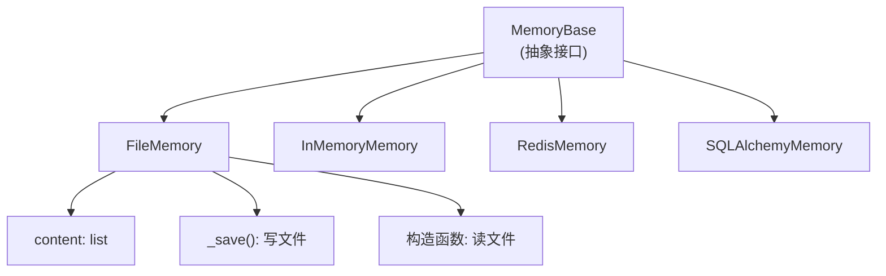

# 第 22 章：构建自定义 Memory——实现 MemoryBase

> **难度**：中等
>
> AgentScope 提供了 `InMemoryMemory`（内存）、`RedisMemory`（Redis）、`SQLAlchemyMemory`（数据库）。如果你想把消息存到文件里呢？这一章我们从零实现一个 `FileMemory`。

## 回顾：MemoryBase 的接口

在第 6 章我们看了 Memory 的使用。现在站在**实现者**的角度。

打开 `src/agentscope/memory/_working_memory/_base.py`：

```python
# _base.py:11
class MemoryBase(StateModule):
```

`MemoryBase` 继承自 `StateModule`，所以自动获得序列化能力。需要实现 5 个抽象方法：

| 方法 | 作用 |
|------|------|
| `add(memories, marks)` | 添加消息 |
| `delete(msg_ids)` | 按 ID 删除消息 |
| `size()` | 返回消息数量 |
| `clear()` | 清空所有消息 |
| `get_memory(mark, exclude_mark)` | 获取消息列表 |

还有 2 个可选方法（有默认实现，抛 `NotImplementedError`）：

| 方法 | 作用 |
|------|------|
| `delete_by_mark(mark)` | 按标记删除 |
| `update_messages_mark(new_mark, old_mark)` | 更新消息标记 |

---

## 参考实现：InMemoryMemory

在实现自定义 Memory 之前，先看看 `InMemoryMemory` 是怎么做的（`_in_memory_memory.py:10`）：

```python
# _in_memory_memory.py:10-17
class InMemoryMemory(MemoryBase):
    def __init__(self):
        super().__init__()
        self.content: list[tuple[Msg, list[str]]] = []  # [(消息, 标记列表)]
        self.register_state("content")
```

存储结构：`content` 是一个元组列表，每个元组是 `(Msg, marks)`。`register_state` 确保序列化时包含 `content`。

### add 方法

```python
# _in_memory_memory.py:93-135 (简化)
async def add(self, memories, marks=None, allow_duplicates=False):
    if memories is None:
        return
    if isinstance(memories, Msg):
        memories = [memories]
    if marks is None:
        marks = []
    elif isinstance(marks, str):
        marks = [marks]

    # 去重
    if not allow_duplicates:
        existing_ids = {msg.id for msg, _ in self.content}
        memories = [msg for msg in memories if msg.id not in existing_ids]

    for msg in memories:
        self.content.append((deepcopy(msg), deepcopy(marks)))
```

注意 `deepcopy`——消息被深拷贝后存储，防止外部修改影响内部状态。

### get_memory 方法

```python
# _in_memory_memory.py:22-91 (简化)
async def get_memory(self, mark=None, exclude_mark=None, prepend_summary=True):
    # 按标记过滤
    filtered = [(msg, marks) for msg, marks in self.content
                if mark is None or mark in marks]

    # 排除标记
    if exclude_mark:
        filtered = [(msg, marks) for msg, marks in filtered
                    if exclude_mark not in marks]

    # 如果有压缩摘要，前置
    if prepend_summary and self._compressed_summary:
        return [Msg("user", self._compressed_summary, "user"),
                *[msg for msg, _ in filtered]]

    return [msg for msg, _ in filtered]
```

---

## 构建 FileMemory

现在实现一个将消息存储到 JSON 文件的 Memory：

```python
"""文件存储的 Memory 实现"""
import json
from pathlib import Path
from copy import deepcopy
from typing import Any

from agentscope.memory import MemoryBase
from agentscope.message import Msg


class FileMemory(MemoryBase):
    """将消息存储到 JSON 文件的 Memory。"""

    def __init__(self, file_path: str = "memory.json") -> None:
        super().__init__()
        self.file_path = Path(file_path)
        self.content: list[tuple[Msg, list[str]]] = []
        self.register_state("content")

        # 从文件加载已有数据
        if self.file_path.exists():
            with open(self.file_path) as f:
                data = json.load(f)
            for item in data.get("content", []):
                msg_dict, marks = item
                self.content.append((Msg.from_dict(msg_dict), marks))

    def _save(self) -> None:
        """保存到文件"""
        data = {
            "content": [[msg.to_dict(), marks] for msg, marks in self.content],
            "_compressed_summary": self._compressed_summary,
        }
        with open(self.file_path, "w") as f:
            json.dump(data, f, ensure_ascii=False, indent=2)

    async def add(self, memories, marks=None, **kwargs) -> None:
        if memories is None:
            return
        if isinstance(memories, Msg):
            memories = [memories]
        if marks is None:
            marks = []
        elif isinstance(marks, str):
            marks = [marks]

        for msg in memories:
            self.content.append((deepcopy(msg), deepcopy(marks)))
        self._save()

    async def delete(self, msg_ids, **kwargs) -> int:
        initial = len(self.content)
        self.content = [(msg, marks) for msg, marks in self.content
                        if msg.id not in msg_ids]
        self._save()
        return initial - len(self.content)

    async def size(self) -> int:
        return len(self.content)

    async def clear(self) -> None:
        self.content.clear()
        self._save()

    async def get_memory(self, mark=None, exclude_mark=None,
                         prepend_summary=True, **kwargs) -> list[Msg]:
        filtered = [(msg, marks) for msg, marks in self.content
                    if mark is None or mark in marks]
        if exclude_mark:
            filtered = [(msg, marks) for msg, marks in filtered
                        if exclude_mark not in marks]

        if prepend_summary and self._compressed_summary:
            return [Msg("user", self._compressed_summary, "user"),
                    *[msg for msg, _ in filtered]]
        return [msg for msg, _ in filtered]
```

关键设计选择：
- 每次 `add`/`delete`/`clear` 后调用 `_save()` 持久化
- 构造函数从文件加载已有数据，实现跨会话持久化
- 存储格式与 `InMemoryMemory.state_dict()` 兼容



> **官方文档对照**：本文对应 [Building Blocks > Memory](https://docs.agentscope.io/building-blocks/memory)。官方文档展示了内置 Memory 类型的选择指南，本章解释了 `MemoryBase` 的 5 个抽象方法——这是实现自定义 Memory 的接口规范。
>
> **推荐阅读**：[AgentScope 1.0 论文](https://arxiv.org/pdf/2508.16279) 第 2.1 节讨论了 Memory 模块的设计目标和扩展点。

---

## 试一试：使用 FileMemory

**步骤**：

1. 将上面的 `FileMemory` 类保存为 `my_memory.py`

2. 创建测试脚本：

```python
import asyncio
from agentscope.message import Msg
from my_memory import FileMemory

async def main():
    memory = FileMemory("test_memory.json")

    # 添加消息
    await memory.add(Msg("user", "你好", "user"))
    await memory.add(Msg("assistant", "你好！有什么可以帮你？", "assistant"))

    # 查看消息
    msgs = await memory.get_memory()
    for m in msgs:
        print(f"{m.name}: {m.content}")

    print(f"共 {await memory.size()} 条消息")

    # 验证持久化：创建新实例
    memory2 = FileMemory("test_memory.json")
    print(f"从文件恢复: {await memory2.size()} 条消息")

asyncio.run(main())
```

3. 观察输出和生成的 `test_memory.json` 文件。

4. 清理测试文件：

```bash
rm test_memory.json
```

---

## 检查点

- `MemoryBase` 定义了 5 个抽象方法和 2 个可选方法
- `InMemoryMemory` 用 `list[tuple[Msg, list[str]]]` 存储，`deepcopy` 保护数据
- 自定义 Memory 需要实现 `add`、`delete`、`size`、`clear`、`get_memory`
- 继承 `StateModule` 自动获得序列化能力
- `register_state` 确保自定义属性被追踪

---

## 下一章预告

Memory 存储消息，Formatter 把消息转换成模型 API 需要的格式。接下来我们构建自定义 Formatter。
