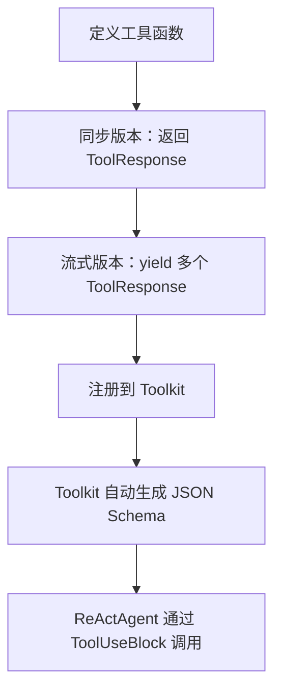
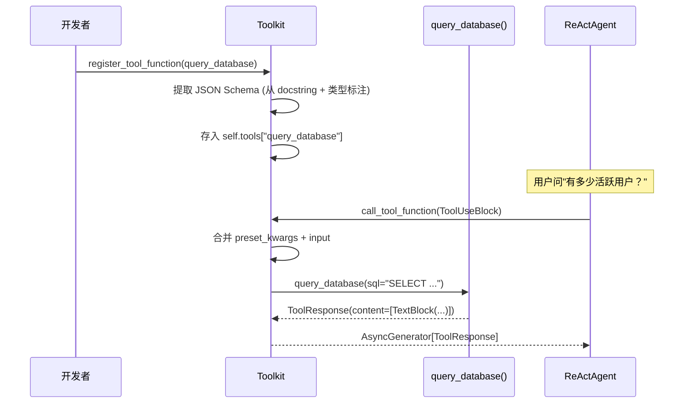

# 第 22 章：造一个新 Tool——数据库查询工具

> **难度**：入门
>
> 你需要给 Agent 加一个数据库查询工具，让它能回答"我们有多少活跃用户？"这类问题。本章从零构建一个完整的 Tool，包括同步和流式两个版本。

## 任务目标

构建一个 SQLite 数据库查询工具，让 ReActAgent 能查询数据库并回答用户问题。

分三步走：
1. **同步版本**：最基础的查询工具，返回完整结果
2. **流式版本**：逐行返回查询结果，适合大数据集
3. **集成验证**：注册到 Toolkit，模拟调用链



---

## 回顾：工具注册的流程

在第 10 章我们追踪了 `Toolkit.call_tool_function()` 的执行路径。现在我们从**开发者视角**看注册流程。

`register_tool_function` 的签名（`_toolkit.py:274`）：

```python
def register_tool_function(
    self,
    tool_func: ToolFunction,
    group_name: str | Literal["basic"] = "basic",
    preset_kwargs: dict | None = None,
    func_name: str | None = None,
    func_description: str | None = None,
    json_schema: dict | None = None,
    ...
) -> None:
```

核心流程：
1. 如果没传 `func_name`，用函数的 `__name__`
2. 如果没传 `json_schema`，从函数签名和 docstring **自动生成**
3. 检查重名，按 `namesake_strategy` 处理
4. 构造 `RegisteredToolFunction` 存入 `self.tools`

### ToolResponse 的结构

`ToolResponse`（`_response.py:12`）是工具函数的返回类型：

```python
@dataclass
class ToolResponse:
    content: List[TextBlock | ImageBlock | AudioBlock | VideoBlock]
    metadata: Optional[dict] = None
    stream: bool = False
    is_last: bool = True
    is_interrupted: bool = False
```

关键字段：
- `content`：内容块列表，至少包含一个 `TextBlock`
- `stream`：是否为流式响应
- `is_last`：流式时标记是否为最后一个 chunk

---

## Step 1：同步版本

### 1.1 创建示例数据库

先用 SQLite 创建一个测试数据库：

```python
import sqlite3

def setup_demo_db(db_path: str = "demo.db") -> None:
    """创建演示用的用户数据库。"""
    conn = sqlite3.connect(db_path)
    conn.execute("""
        CREATE TABLE IF NOT EXISTS users (
            id INTEGER PRIMARY KEY,
            name TEXT NOT NULL,
            email TEXT UNIQUE NOT NULL,
            status TEXT DEFAULT 'active',
            created_at TIMESTAMP DEFAULT CURRENT_TIMESTAMP
        )
    """)
    # 插入示例数据
    conn.executemany(
        "INSERT OR IGNORE INTO users (name, email, status) VALUES (?, ?, ?)",
        [
            ("Alice", "alice@example.com", "active"),
            ("Bob", "bob@example.com", "active"),
            ("Charlie", "charlie@example.com", "inactive"),
            ("Diana", "diana@example.com", "active"),
            ("Eve", "eve@example.com", "active"),
        ],
    )
    conn.commit()
    conn.close()
```

### 1.2 定义工具函数

```python
import sqlite3
from agentscope.tool._response import ToolResponse
from agentscope.message import TextBlock


def query_database(
    sql: str,
    db_path: str = "demo.db",
) -> ToolResponse:
    """执行 SQL 查询并返回结果。

    Args:
        sql (`str`):
            要执行的 SQL 查询语句（仅支持 SELECT）
        db_path (`str`, optional):
            数据库文件路径，默认为 demo.db

    Returns:
        `ToolResponse`: 查询结果
    """
    # 安全检查：只允许 SELECT
    normalized = sql.strip().upper()
    if not normalized.startswith("SELECT"):
        return ToolResponse(
            content=[TextBlock(type="text", text="错误：仅支持 SELECT 查询")]
        )

    conn = sqlite3.connect(db_path)
    conn.row_factory = sqlite3.Row
    try:
        cursor = conn.execute(sql)
        rows = cursor.fetchall()
        columns = [desc[0] for desc in cursor.description]

        if not rows:
            text = "查询结果为空。"
        else:
            lines = [f"共 {len(rows)} 行："]
            # 表头
            lines.append(" | ".join(columns))
            lines.append("-" * (len(" | ".join(columns))))
            # 数据行
            for row in rows:
                lines.append(" | ".join(str(row[col]) for col in columns))
            text = "\n".join(lines)
    except Exception as e:
        text = f"查询失败：{e}"
    finally:
        conn.close()

    return ToolResponse(content=[TextBlock(type="text", text=text)])
```

### 1.3 注册并测试

```python
from agentscope.tool import Toolkit

toolkit = Toolkit()
toolkit.register_tool_function(query_database)

# 查看自动生成的 JSON Schema
import json
for name, func in toolkit.tools.items():
    print(f"工具名: {name}")
    print(json.dumps(func.json_schema, ensure_ascii=False, indent=2))
```

自动生成的 Schema 会包含：
- `sql` 参数（string 类型，required）
- `db_path` 参数（string 类型，optional，默认 "demo.db"）
- 从 docstring 提取的参数描述

### 1.4 模拟工具调用

不需要 API key，直接用 `call_tool_function` 测试：

```python
import asyncio
from agentscope.message import ToolUseBlock

async def test_sync():
    tool_call = ToolUseBlock(
        type="tool_use",
        id="call_test",
        name="query_database",
        input={"sql": "SELECT COUNT(*) as cnt FROM users WHERE status='active'"},
    )

    async for response in toolkit.call_tool_function(tool_call):
        for block in response.content:
            print(block["text"])

asyncio.run(test_sync())
```

---

## Step 2：流式版本

当查询返回大量数据时，逐行返回结果比等全部查完再返回更好。这需要用 `AsyncGenerator` 实现流式。

### 2.1 流式工具函数

```python
import sqlite3
from typing import AsyncGenerator
from agentscope.tool._response import ToolResponse
from agentscope.message import TextBlock


async def query_database_stream(
    sql: str,
    db_path: str = "demo.db",
) -> AsyncGenerator[ToolResponse, None]:
    """流式执行 SQL 查询，逐行返回结果。

    Args:
        sql (`str`):
            要执行的 SQL 查询语句（仅支持 SELECT）
        db_path (`str`, optional):
            数据库文件路径，默认为 demo.db

    Returns:
        `AsyncGenerator[ToolResponse, None]`: 逐行返回的查询结果
    """
    normalized = sql.strip().upper()
    if not normalized.startswith("SELECT"):
        yield ToolResponse(
            content=[TextBlock(type="text", text="错误：仅支持 SELECT 查询")],
            is_last=True,
        )
        return

    conn = sqlite3.connect(db_path)
    conn.row_factory = sqlite3.Row
    try:
        cursor = conn.execute(sql)
        columns = [desc[0] for desc in cursor.description]

        # 第一行：表头
        header = " | ".join(columns)
        yield ToolResponse(
            content=[TextBlock(type="text", text=header)],
            stream=True,
            is_last=False,
        )

        # 逐行返回数据
        for i, row in enumerate(cursor):
            line = " | ".join(str(row[col]) for col in columns)
            is_last = i == cursor.rowcount - 1 if cursor.rowcount > 0 else False
            yield ToolResponse(
                content=[TextBlock(type="text", text=line)],
                stream=True,
                is_last=is_last,
            )

        if cursor.rowcount <= 0:
            yield ToolResponse(
                content=[TextBlock(type="text", text="查询结果为空。")],
                is_last=True,
            )
    except Exception as e:
        yield ToolResponse(
            content=[TextBlock(type="text", text=f"查询失败：{e}")],
            is_last=True,
        )
    finally:
        conn.close()
```

### 2.2 注册流式工具

```python
toolkit2 = Toolkit()
toolkit2.register_tool_function(query_database_stream)
```

注意：从 Toolkit 的角度看，同步和流式的注册方式完全一样。区别在于 `call_tool_function`（`_toolkit.py:853`）会检测返回类型——如果函数返回 `AsyncGenerator`，它会自动处理流式迭代。

`call_tool_function` 内部的处理逻辑（简化）：

```python
# _toolkit.py:870-1033（简化）
result = tool_func.original_func(**kwargs)

if isinstance(result, AsyncGenerator):
    async for chunk in result:
        yield chunk
elif isinstance(result, ToolResponse):
    yield result
```

### 2.3 测试流式工具

```python
async def test_stream():
    tool_call = ToolUseBlock(
        type="tool_use",
        id="call_stream",
        name="query_database_stream",
        input={"sql": "SELECT * FROM users"},
    )

    async for response in toolkit2.call_tool_function(tool_call):
        for block in response.content:
            print(f"[{'最后一条' if response.is_last else '流式中'}] {block['text']}")

asyncio.run(test_stream())
```

---

## Step 3：集成到 Agent

### 3.1 使用 preset_kwargs 注入数据库路径

在生产环境中，你不希望模型知道数据库路径。用 `preset_kwargs` 把路径"预设"进去：

```python
toolkit3 = Toolkit()
toolkit3.register_tool_function(
    query_database,
    preset_kwargs={"db_path": "/data/production.db"},
)
```

这样 JSON Schema 中不会出现 `db_path` 参数，但调用时 `preset_kwargs` 会和 `tool_call["input"]` 合并：

```python
# _toolkit.py:937（简化）
kwargs = {**tool_func.preset_kwargs, **(tool_call.get("input", {}) or {})}
```

`tool_call["input"]` 的同名键会覆盖 `preset_kwargs`——所以模型传的参数优先。

### 3.2 完整的 Agent 配置

```python
import agentscope
from agentscope.agent import ReActAgent
from agentscope.model import OpenAIChatModel
from agentscope.formatter import OpenAIChatFormatter
from agentscope.memory import InMemoryMemory

agentscope.init(project="db-agent")

toolkit = Toolkit()
toolkit.register_tool_function(query_database)

agent = ReActAgent(
    name="db_assistant",
    sys_prompt="你是一个数据库助手。用 query_database 工具回答用户的数据问题。",
    model=OpenAIChatModel(model_name="gpt-4o"),
    formatter=OpenAIChatFormatter(),
    toolkit=toolkit,
    memory=InMemoryMemory(),
)

# 调用（需要 API key）
# result = await agent(Msg("user", "有多少活跃用户？", "user"))
```

### 3.3 不用 API key 的替代验证

用 `call_tool_function` 直接测试工具调用，跳过模型层：

```python
async def verify_integration():
    setup_demo_db("demo.db")

    # 模拟模型返回的 ToolUseBlock
    tool_call = ToolUseBlock(
        type="tool_use",
        id="call_1",
        name="query_database",
        input={"sql": "SELECT COUNT(*) as total, status FROM users GROUP BY status"},
    )

    async for response in toolkit.call_tool_function(tool_call):
        print("工具结果:", response.content[0]["text"])

asyncio.run(verify_integration())
```

---

## 设计一瞥

> **设计一瞥**：为什么工具函数不直接返回字符串？
> 如果工具函数只返回 `str`，Toolkit 内部需要把它包装成 `ToolResponse(content=[TextBlock(text=...)])`。AgentScope 选择让工具函数直接返回 `ToolResponse`，这样工具可以返回多模态内容（图片、音频）和流式响应，不需要框架猜测包装方式。
> 代价：工具函数需要多写几行代码来构造 `ToolResponse`。但 `call_tool_function`（`_toolkit.py:853`）内部也处理了直接返回字符串的情况，会自动包装——所以实际上两种方式都支持。

---

## 完整流程图



---

## 试一试：给工具加一个缓存中间件

这个练习不需要 API key。

**目标**：给 `query_database` 加一个简单的缓存中间件，相同 SQL 不重复查询。

**步骤**：

1. 定义缓存中间件：

```python
import hashlib
import json

_cache: dict[str, list] = {}

async def cache_middleware(kwargs: dict, next_handler) -> AsyncGenerator[ToolResponse, None]:
    """简单的查询缓存中间件。"""
    sql = kwargs.get("tool_call", {}).get("input", {}).get("sql", "")
    cache_key = hashlib.md5(sql.encode()).hexdigest()

    if cache_key in _cache:
        for response in _cache[cache_key]:
            yield response
        return

    results = []
    async for response in await next_handler(**kwargs):
        results.append(response)
        yield response

    _cache[cache_key] = results
```

2. 注册中间件并测试：

```python
toolkit.register_middleware(cache_middleware)

# 第一次调用（实际查询）
async for r in toolkit.call_tool_function(ToolUseBlock(
    type="tool_use", id="c1", name="query_database",
    input={"sql": "SELECT COUNT(*) FROM users"},
)):
    print("首次:", r.content[0]["text"])

# 第二次调用（命中缓存）
async for r in toolkit.call_tool_function(ToolUseBlock(
    type="tool_use", id="c2", name="query_database",
    input={"sql": "SELECT COUNT(*) FROM users"},
)):
    print("缓存:", r.content[0]["text"])
```

3. 观察输出：第二次调用应该返回缓存的结果。

---

## PR 检查清单

提交一个新 Tool 函数的 PR 时，检查以下项：

- [ ] **类型标注**：所有参数有类型标注，返回类型明确
- [ ] **Docstring**：按 Google 风格写 Args 和 Returns，框架从中提取 JSON Schema
- [ ] **ToolResponse**：返回 `ToolResponse`（不是裸字符串或 dict）
- [ ] **错误处理**：异常不暴露内部信息，返回用户友好的错误消息
- [ ] **测试**：至少覆盖正常路径、错误路径、边界情况
- [ ] **`__init__.py` 导出**：如果是公共 API，在对应模块的 `__init__.py` 中导出
- [ ] **pre-commit 通过**：`pre-commit run --all-files` 无报错

---

## 检查点

你现在理解了：

- **同步工具**：定义函数 → 注册到 Toolkit → 自动生成 JSON Schema → `call_tool_function` 调用
- **流式工具**：函数返回 `AsyncGenerator[ToolResponse, None]`，Toolkit 自动处理流式迭代
- **preset_kwargs**：预设参数不暴露给模型，运行时与工具调用参数合并
- **中间件**：可以在工具执行前后插入缓存、日志等逻辑
- **ToolResponse** 是工具函数的标准返回类型，支持多模态内容和流式

**自检练习**：

1. 如果你的工具函数返回的是 `str` 而不是 `ToolResponse`，`call_tool_function` 会怎么处理？（提示：读 `_toolkit.py:970` 附近的返回类型判断逻辑）
2. `preset_kwargs={"db_path": "/prod.db"}` 和模型传入 `input={"db_path": "/dev.db", "sql": "..."}`，最终 `db_path` 的值是什么？（提示：看合并顺序 `{**preset, **input}`）

---

## 下一章预告

我们造了一个新 Tool。下一章，我们造一个更复杂的组件——**新的 Model Provider**。接入一个虚构的 "FastLLM" API，从非流式到流式到结构化输出，三步走。
