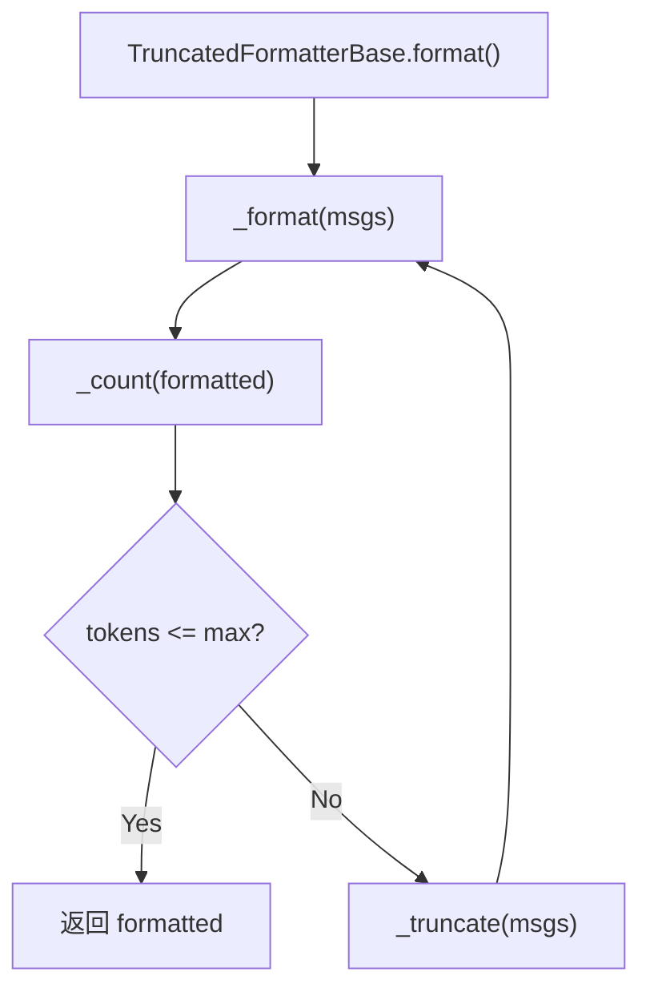

# 第 23 章：构建自定义 Formatter——适配新模型 API

> **难度**：进阶
>
> 你想接入一个新的大模型 API，它的消息格式和 OpenAI 不一样。怎么写一个 Formatter 来适配？

## 回顾：Formatter 的继承体系

在第 8 章和第 16 章我们看了 Formatter 的三层继承和策略模式。这一章我们实现一个自定义 Formatter。

```
FormatterBase              # 抽象接口
  └── TruncatedFormatterBase  # 带截断的模板方法
        └── OpenAIChatFormatter   # 具体实现
        └── AnthropicChatFormatter
        └── 你的自定义 Formatter
```

---

## FormatterBase 的接口

打开 `src/agentscope/formatter/_formatter_base.py`：

```python
# _formatter_base.py:11-15
class FormatterBase:
    @abstractmethod
    async def format(self, *args, **kwargs) -> list[dict[str, Any]]:
        """Format the Msg objects to a list of dictionaries."""
```

只有一个抽象方法：`format()`。输入是 `Msg` 对象，输出是 `list[dict]`——模型 API 需要的消息格式。

---

## TruncatedFormatterBase 的模板方法

如果你需要 token 截断功能（通常需要），继承 `TruncatedFormatterBase`（`_truncated_formatter_base.py:19`）：

```python
class TruncatedFormatterBase(FormatterBase, ABC):
    async def format(self, msgs, **kwargs):
        while True:
            formatted = await self._format(msgs)     # 子类实现
            n_tokens = await self._count(formatted)   # 子类实现
            if n_tokens <= self.max_tokens:
                return formatted
            msgs = self._truncate(msgs)               # 子类实现
```

需要实现 3 个方法：

| 方法 | 作用 |
|------|------|
| `_format(msgs)` | 将 `Msg` 列表转为 API 格式 |
| `_count(formatted)` | 计算格式化后消息的 token 数 |
| `_truncate(msgs)` | 截断消息列表（移除最早的） |

---

## 构建 SimpleFormatter

为了演示，我们构建一个最简单的 Formatter——把 `Msg` 转为 `{"role": ..., "content": ...}` 格式：

```python
"""一个简单的 Formatter 演示"""
from typing import Any
from agentscope.formatter import FormatterBase
from agentscope.message import Msg


class SimpleFormatter(FormatterBase):
    """简单的消息格式化器，输出通用格式。"""

    async def format(self, msgs: list[Msg], **kwargs) -> list[dict[str, Any]]:
        result = []
        for msg in msgs:
            role = msg.role if msg.role in ("user", "assistant", "system") else "user"

            # 处理 content
            if isinstance(msg.content, str):
                content = msg.content
            elif isinstance(msg.content, list):
                # 混合内容（文本+图片等），只提取文本
                texts = []
                for block in msg.content:
                    if isinstance(block, dict) and block.get("type") == "text":
                        texts.append(block["text"])
                    elif isinstance(block, dict):
                        texts.append(f"[{block.get('type', 'unknown')}]")
                content = "\n".join(texts)
            else:
                content = str(msg.content)

            result.append({"role": role, "content": content})

        return result
```

使用方式：

```python
from agentscope.message import Msg

formatter = SimpleFormatter()
msgs = [
    Msg("system", "你是一个助手", "system"),
    Msg("user", "你好", "user"),
    Msg("assistant", "你好！", "assistant"),
]

import asyncio
formatted = asyncio.run(formatter.format(msgs))
# [
#   {"role": "system", "content": "你是一个助手"},
#   {"role": "user", "content": "你好"},
#   {"role": "assistant", "content": "你好！"},
# ]
```

---

## 带截断的版本

如果需要 token 截断，继承 `TruncatedFormatterBase`：

```python
from agentscope.formatter import TruncatedFormatterBase


class SimpleTruncatedFormatter(TruncatedFormatterBase):
    """带截断功能的简单 Formatter。"""

    async def _format(self, msgs, **kwargs):
        # 和 SimpleFormatter.format 一样的逻辑
        result = []
        for msg in msgs:
            role = msg.role if msg.role in ("user", "assistant", "system") else "user"
            content = msg.content if isinstance(msg.content, str) else str(msg.content)
            result.append({"role": role, "content": content})
        return result

    async def _count(self, formatted):
        # 简单估算：中文约 1 字/token，英文约 0.75 词/token
        total = 0
        for msg in formatted:
            total += len(msg.get("content", ""))
        return total

    async def _truncate(self, msgs):
        # 移除最早的消息（跳过系统消息）
        if len(msgs) <= 1:
            return msgs
        # 保留第一条（通常是系统消息），移除第二条
        return [msgs[0]] + msgs[2:]
```

`TruncatedFormatterBase.format()` 会自动循环调用 `_format` → `_count` → `_truncate`，直到 token 数在限制内。



AgentScope 官方文档的 Building Blocks > Models 页面展示了不同模型的使用方法。本章聚焦于 Formatter 的接口规范和实现步骤——这是适配新模型 API 的关键扩展点。

AgentScope 1.0 论文对 Formatter 与 Model 分离的设计说明是：

> "we abstract foundational components essential for agentic applications and provide unified interfaces and extensible modules"
>
> — AgentScope 1.0: A Comprehensive Framework for Building Agentic Applications, arXiv:2508.16279, Section 2.1

Formatter 的独立设计正是"可扩展模块"思想的体现：新增模型提供商只需要实现对应的 Formatter（将 `Msg` 列表转为该 API 要求的 JSON 格式），不需要修改 Model 的代码。AgentScope 已为 OpenAI、Anthropic、DashScope、Gemini、Ollama、DeepSeek 等提供了内置 Formatter 实现，每个 API 对消息格式的要求略有不同（例如 Anthropic 把系统提示放在单独的 `system` 字段，而不是 `{"role": "system"}` 消息中）。

---

## 试一试：对比不同 Formatter 的输出

**步骤**：

1. 搜索已有的 Formatter 实现：

```bash
grep -n "class.*Formatter.*TruncatedFormatterBase" src/agentscope/formatter/*.py
```

2. 打开 `src/agentscope/formatter/_openai_formatter.py`，找到 `_format` 方法（第 168 行附近）。对比它和 `SimpleFormatter` 的区别——特别注意 `ToolUseBlock` 和 `ImageBlock` 的处理。

3. 打开 `src/agentscope/formatter/_anthropic_formatter.py`，对比系统消息的处理方式。

---

## 检查点

- `FormatterBase` 只有一个抽象方法：`format(msgs) -> list[dict]`
- `TruncatedFormatterBase` 用模板方法实现截断循环，需要实现 `_format`、`_count`、`_truncate`
- 自定义 Formatter 只需关心格式转换，不需要关心 token 截断
- 实际生产级 Formatter 还需处理 `ToolUseBlock`、`ImageBlock` 等特殊 block

---

## 下一章预告

Formatter 是静态适配。如果我们想在工具执行前后插入逻辑呢？下一章我们写自定义中间件。
