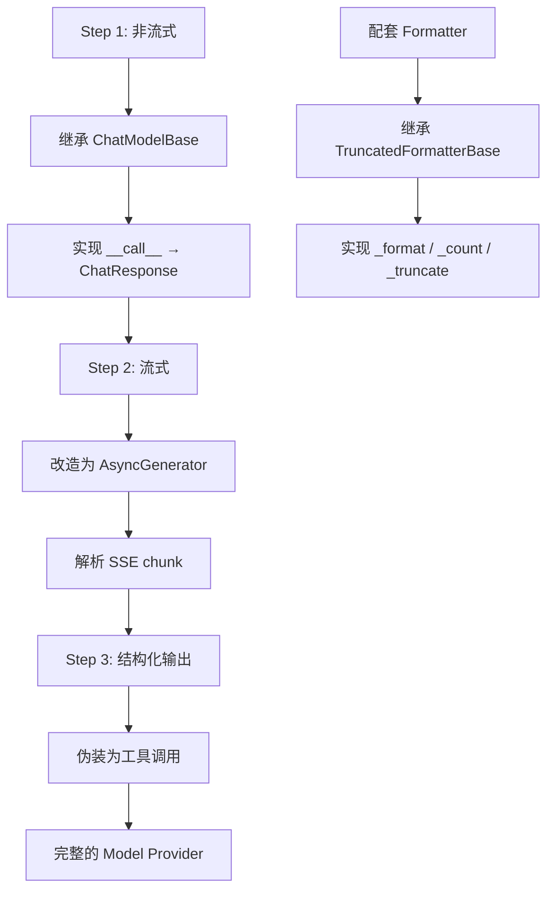
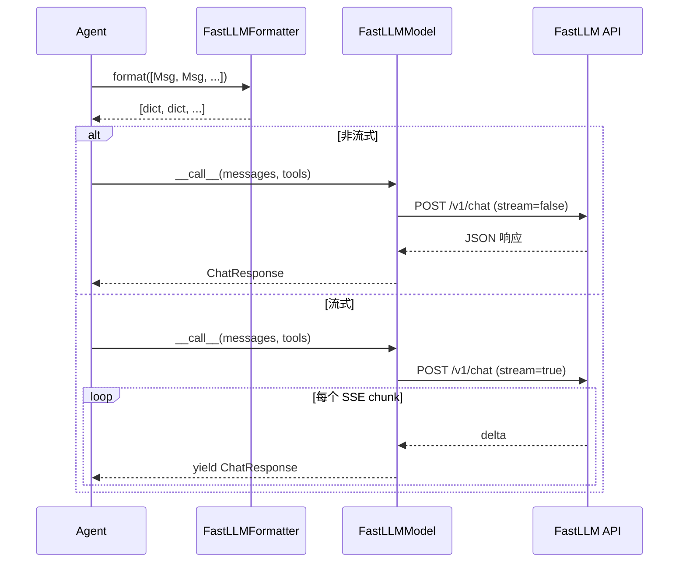

# 第 23 章：造一个新 Model Provider——接入 FastLLM API

> **难度**：进阶
>
> 你想接入一个新的大模型服务 "FastLLM"。它的 API 格式和 OpenAI 不一样——你需要同时写 Model 和 Formatter。本章分三步走：非流式 → 流式 → 结构化输出。

## 任务目标

接入一个假想的 "FastLLM" API（教学用，读者可以用 mock 替代真实 API），完整实现 Model Provider 的三个层次。



---

## 回顾：Model 和 Formatter 的接口

### ChatModelBase

`ChatModelBase`（`_model_base.py:13`）是所有模型适配器的基类：

```python
class ChatModelBase:
    model_name: str
    stream: bool

    @abstractmethod
    async def __call__(
        self, *args, **kwargs,
    ) -> ChatResponse | AsyncGenerator[ChatResponse, None]:
        pass
```

只有一个抽象方法 `__call__`。还有辅助方法 `_validate_tool_choice`（`_model_base.py:46`），验证 `tool_choice` 参数合法性（`"auto"` / `"none"` / `"required"` / 具体函数名）。

### ChatResponse 和 ChatUsage

`ChatResponse`（`_model_response.py:20`）：

```python
@dataclass
class ChatResponse(DictMixin):
    content: Sequence[TextBlock | ToolUseBlock | ThinkingBlock | AudioBlock]
    id: str
    created_at: str
    type: Literal["chat"]
    usage: ChatUsage | None
    metadata: dict | None
```

`ChatUsage`（`_model_usage.py:11`）：

```python
@dataclass
class ChatUsage(DictMixin):
    input_tokens: int
    output_tokens: int
    time: float
    type: Literal["chat"]
    metadata: dict | None
```

### FormatterBase 接口

`FormatterBase`（`_formatter_base.py:11`）：

```python
class FormatterBase:
    @abstractmethod
    async def format(self, *args, **kwargs) -> list[dict[str, Any]]:
        pass
```

`TruncatedFormatterBase`（`_truncated_formatter_base.py:19`）需要实现 `_format`、`_count`、`_truncate` 三个方法。

---

## Step 1：非流式版本

### 1.1 设计 FastLLM 的 API 格式

假设 FastLLM 的 API 格式如下（教学用虚构协议）：

**请求**：
```json
POST /v1/chat
{
    "model": "fastllm-v1",
    "messages": [{"role": "user", "content": "你好"}],
    "tools": [...],
    "stream": false
}
```

**响应**：
```json
{
    "id": "resp_123",
    "output": {
        "text": "你好！有什么可以帮你？",
        "tool_calls": null
    },
    "usage": {"input_tokens": 5, "output_tokens": 8}
}
```

### 1.2 实现 FastLLMFormatter

FastLLM 的消息格式和 OpenAI 类似，但有细微差别：

```python
from typing import Any
from agentscope.formatter import TruncatedFormatterBase
from agentscope.message import Msg


class FastLLMFormatter(TruncatedFormatterBase):
    """FastLLM API 的消息格式化器。

    FastLLM 的格式和 OpenAI 基本相同，
    但系统消息放在单独的 system 字段，不在 messages 数组中。
    """

    async def _format(self, msgs: list[Msg], **kwargs) -> list[dict[str, Any]]:
        result = []
        for msg in msgs:
            # 提取文本内容
            if isinstance(msg.content, str):
                text = msg.content
            elif isinstance(msg.content, list):
                texts = []
                for block in msg.content:
                    if isinstance(block, dict) and block.get("type") == "text":
                        texts.append(block["text"])
                text = "\n".join(texts)
            else:
                text = str(msg.content)

            result.append({"role": msg.role, "content": text})
        return result

    async def _count(self, formatted: list[dict]) -> int | None:
        # 简单估算，生产环境应该用 tokenizer
        total = sum(len(m.get("content", "")) for m in formatted)
        return total

    async def _truncate(self, msgs: list[Msg]) -> list[Msg]:
        # 移除最早的非系统消息
        if len(msgs) <= 1:
            return msgs
        return [msgs[0]] + msgs[2:]
```

### 1.3 实现 FastLLMModel（非流式）

```python
import time
from agentscope.model import ChatModelBase
from agentscope.model._model_response import ChatResponse
from agentscope.model._model_usage import ChatUsage
from agentscope.message import TextBlock


class FastLLMModel(ChatModelBase):
    """FastLLM 模型适配器（教学演示）。"""

    def __init__(
        self,
        model_name: str = "fastllm-v1",
        stream: bool = False,
        api_key: str | None = None,
        base_url: str = "https://api.fastllm.example.com",
    ) -> None:
        super().__init__(model_name=model_name, stream=stream)
        self.api_key = api_key
        self.base_url = base_url

    async def __call__(
        self,
        messages: list[dict],
        tools: list[dict] | None = None,
        tool_choice: str | None = None,
        **kwargs,
    ) -> ChatResponse:
        start_time = time.time()

        # 1. 组装请求
        payload = {
            "model": self.model_name,
            "messages": messages,
            "stream": False,
        }
        if tools:
            payload["tools"] = tools

        # 2. 发送请求（实际代码用 httpx/aiohttp）
        # response = await httpx.post(f"{self.base_url}/v1/chat", json=payload)
        # 这里用 mock 替代
        response = self._mock_response(messages)

        elapsed = time.time() - start_time

        # 3. 解析响应
        return ChatResponse(
            content=[TextBlock(type="text", text=response["output"]["text"])],
            id=response["id"],
            created_at=time.strftime("%Y-%m-%dT%H:%M:%S"),
            type="chat",
            usage=ChatUsage(
                input_tokens=response["usage"]["input_tokens"],
                output_tokens=response["usage"]["output_tokens"],
                time=elapsed,
            ),
        )

    def _mock_response(self, messages: list[dict]) -> dict:
        """用于测试的 mock 响应。"""
        last_msg = messages[-1]["content"] if messages else ""
        return {
            "id": "resp_mock",
            "output": {"text": f"收到：{last_msg[:50]}", "tool_calls": None},
            "usage": {"input_tokens": 10, "output_tokens": 5},
        }
```

---

## Step 2：流式版本

### 2.1 FastLLM 的 SSE 流格式

假设 FastLLM 的流式响应格式：

```
data: {"id": "resp_123", "delta": {"text": "你"}, "done": false}
data: {"id": "resp_123", "delta": {"text": "好"}, "done": false}
data: {"id": "resp_123", "delta": {"text": "！"}, "done": true, "usage": {...}}
```

### 2.2 流式实现

在 `__call__` 中根据 `self.stream` 分流：

```python
from typing import AsyncGenerator
from collections import OrderedDict
from agentscope.message import ToolUseBlock


class FastLLMModel(ChatModelBase):
    # ... __init__ 和非流式部分同上 ...

    async def __call__(
        self,
        messages: list[dict],
        tools: list[dict] | None = None,
        tool_choice: str | None = None,
        **kwargs,
    ) -> ChatResponse | AsyncGenerator[ChatResponse, None]:
        if self.stream:
            return self._stream_call(messages, tools)
        else:
            return await self._non_stream_call(messages, tools)

    async def _non_stream_call(self, messages, tools) -> ChatResponse:
        """非流式调用。"""
        # 同 Step 1 的逻辑
        ...

    async def _stream_call(
        self, messages, tools
    ) -> AsyncGenerator[ChatResponse, None]:
        """流式调用。"""
        start_time = time.time()

        # 模拟 SSE 流（实际代码用 aiohttp SSE client）
        chunks = ["你", "好", "！"]
        total_text = ""

        for i, chunk_text in enumerate(chunks):
            total_text += chunk_text
            is_last = i == len(chunks) - 1

            usage = None
            if is_last:
                usage = ChatUsage(
                    input_tokens=10,
                    output_tokens=len(total_text),
                    time=time.time() - start_time,
                )

            yield ChatResponse(
                content=[TextBlock(type="text", text=total_text)],
                id="resp_stream",
                created_at=time.strftime("%Y-%m-%dT%H:%M:%S"),
                type="chat",
                usage=usage,
            )
```

### 2.3 参考真实实现

OpenAI 的流式解析在 `_parse_openai_stream_response`（`_openai_model.py:346`）中。核心思路：

```python
# _openai_model.py:376（简化）
text = ""           # 累积文本
tool_calls = OrderedDict()   # 累积工具调用

async for chunk in response:
    delta = chunk.choices[0].delta

    if delta.content:
        text += delta.content
        # 在句子边界 yield
        yield ChatResponse(content=[TextBlock(type="text", text=text)])

    if delta.tool_calls:
        # 累积工具调用的 name 和 arguments
        for tc in delta.tool_calls:
            tool_calls[tc.index]["arguments"] += tc.arguments
```

关键点：流式解析是一个**累积**过程——每个 chunk 只包含增量（delta），解析器需要把增量累积起来。

---

## Step 3：结构化输出

结构化输出的原理在第 9 章已经介绍过：把 Pydantic 模型伪装成"工具调用"，让模型以为要调用工具，从而获得特定格式的 JSON。

### 3.1 实现思路

```python
from pydantic import BaseModel

class UserInfo(BaseModel):
    """用户想要的结构化输出。"""
    name: str
    age: int
    interests: list[str]


async def structured_call(self, messages, structured_model: type[BaseModel]) -> ChatResponse:
    """通过工具调用实现结构化输出。"""

    # 1. 把 Pydantic 模型转为 JSON Schema（伪装成工具）
    fake_tool = {
        "type": "function",
        "function": {
            "name": "generate_response",
            "description": "Generate the structured response.",
            "parameters": structured_model.model_json_schema(),
        },
    }

    # 2. 带 tool_choice="required" 调用模型
    response = await self._non_stream_call(
        messages,
        tools=[fake_tool],
    )

    # 3. 从 ToolUseBlock 中提取参数
    for block in response.content:
        if isinstance(block, dict) and block.get("type") == "tool_use":
            data = block.get("input", {})
            return ChatResponse(
                content=[TextBlock(type="text", text=str(data))],
                id=response.id,
                metadata=data,  # 结构化数据放在 metadata
            )

    return response
```

### 3.2 参考 OpenAI 的实现

`OpenAIChatModel` 在 `_structured_via_tool_call`（`_openai_model.py:730`）中实现了完整的结构化输出路径。核心步骤：
1. 将 Pydantic 模型转为工具 JSON Schema
2. 设置 `tool_choice={"type": "function", "function": {"name": "generate_response"}}`
3. 调用模型，从响应中提取 `ToolUseBlock`
4. 用 `structured_model.model_validate()` 验证输出格式

---

## 设计一瞥

> **设计一瞥**：为什么 Model 和 Formatter 要分开？
> 你可能觉得"格式转换应该是 Model 自己的事"。但分开有好处：同一个 `FastLLMFormatter` 可能适用于所有兼容 FastLLM 协议的服务（不同部署、不同版本）。如果 Formatter 和 Model 绑定，换一个兼容服务就要写新的 Model 类。
> 代价：用户需要自己选择 Formatter 和 Model 的组合。详见卷四第 35 章。

---

## 完整流程图



---

## 试一试：对比 OpenAI 和 FastLLM 的 Formatter

这个练习不需要 API key。

**目标**：理解不同 API 格式的差异。

**步骤**：

1. 打开 `src/agentscope/formatter/_openai_formatter.py`，找到 `_format` 方法
2. 打开 `src/agentscope/formatter/_anthropic_formatter.py`，对比系统消息的处理方式
3. 回答以下问题：
   - OpenAI 如何处理系统消息？（放在 messages 数组中，role="system"）
   - Anthropic 如何处理系统消息？（放在单独的 `system` 字段中）
   - 你的 FastLLM Formatter 应该如何处理？为什么？

4. **进阶**：查看 Formatter 的截断逻辑：

```bash
grep -n "_truncate" src/agentscope/formatter/_truncated_formatter_base.py
```

理解 `_truncate` 在什么条件下被调用，以及它如何决定删除哪些消息。

---

## PR 检查清单

提交新 Model Provider 的 PR 时：

- [ ] **ChatModelBase 子类**：`__call__` 正确处理流式/非流式
- [ ] **配套 Formatter**：继承 `TruncatedFormatterBase`，实现 `_format`/`_count`/`_truncate`
- [ ] **ChatResponse 构造**：`content` 使用正确的 ContentBlock 类型
- [ ] **ChatUsage 记录**：准确记录 token 消耗和耗时
- [ ] **`__init__.py` 导出**：在 `model/__init__.py` 和 `formatter/__init__.py` 中导出
- [ ] **测试**：覆盖非流式、流式（用 mock）、结构化输出
- [ ] **Docstring**：所有公共方法按项目规范写 docstring
- [ ] **pre-commit 通过**

---

## 检查点

你现在理解了：

- **Model Provider** 的三步开发流程：非流式 → 流式 → 结构化输出
- **ChatModelBase** 只有一个抽象方法 `__call__`，返回 `ChatResponse` 或 `AsyncGenerator`
- **流式解析**是增量累积过程——每个 chunk 包含 delta，解析器累积后构造 `ChatResponse`
- **结构化输出**通过把 Pydantic 模型伪装成工具调用实现
- **Formatter 和 Model 分离**，使得同一个格式转换可以复用于多个兼容服务

**自检练习**：

1. 如果 FastLLM 的 API 不支持 `tools` 参数，你的 Model 还能支持工具调用吗？（提示：思考 `tool_choice` 的处理）
2. 流式模式下，`yield ChatResponse` 的 `content` 应该是累积文本还是增量文本？（提示：看 `_openai_model.py:376` 的 `text` 变量）

---

## 下一章预告

我们造了 Tool 和 Model。下一章，我们造一个 **Memory Backend**——用 SQLite 实现持久化记忆，让 Agent 重启后还能记住之前的对话。
