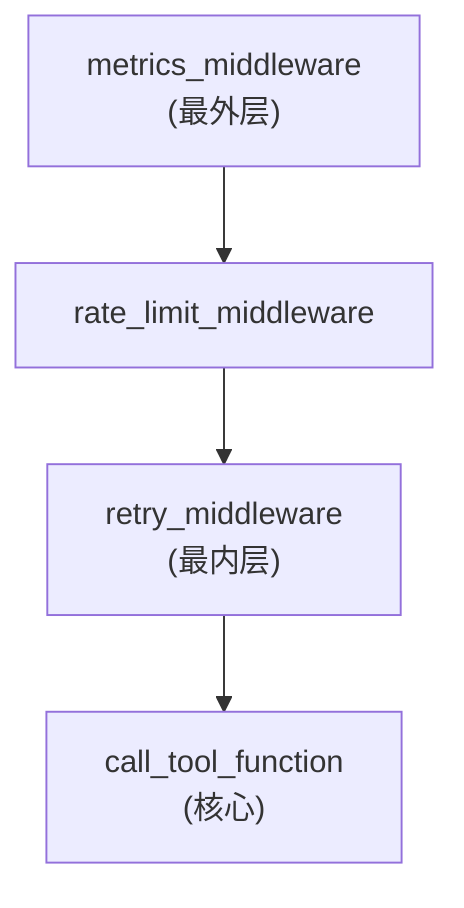

# 第 24 章：构建自定义中间件——工具执行的拦截与增强

> **难度**：中等
>
> 你需要在生产环境中监控工具调用、限流、缓存。这些横切关注点怎么用中间件实现？

## 回顾：洋葱模型

在第 18 章我们看了 `_apply_middlewares` 的洋葱模型实现。这一章我们站在**中间件开发者**的角度，构建实用的中间件。

中间件的签名：

```python
async def my_middleware(
    kwargs: dict,           # {"tool_call": ToolUseBlock}
    next_handler: Callable,  # 下一层
) -> AsyncGenerator[ToolResponse, None]:
    # pre-processing
    async for response in await next_handler(**kwargs):
        yield response
    # post-processing
```

---

## 实战一：限流中间件

防止工具被过于频繁地调用：

```python
"""限流中间件"""
import time
from collections import defaultdict

class RateLimiter:
    """简单的令牌桶限流器"""

    def __init__(self, max_calls: int, period: float):
        self.max_calls = max_calls
        self.period = period
        self._timestamps: dict[str, list[float]] = defaultdict(list)

    def is_allowed(self, tool_name: str) -> bool:
        now = time.time()
        timestamps = self._timestamps[tool_name]
        # 移除过期的记录
        timestamps[:] = [t for t in timestamps if now - t < self.period]
        if len(timestamps) >= self.max_calls:
            return False
        timestamps.append(now)
        return True

# 创建限流器：每分钟最多 10 次调用
limiter = RateLimiter(max_calls=10, period=60.0)

async def rate_limit_middleware(kwargs, next_handler):
    from agentscope.message import TextBlock
    from agentscope.tool import ToolResponse

    tool_name = kwargs["tool_call"]["name"]

    if not limiter.is_allowed(tool_name):
        yield ToolResponse(
            content=[TextBlock(
                type="text",
                text=f"工具 {tool_name} 调用频率超限，请稍后重试"
            )]
        )
        return  # 不调用 next_handler，直接返回

    async for response in await next_handler(**kwargs):
        yield response
```

注册方式：

```python
from agentscope.tool import Toolkit

toolkit = Toolkit()
toolkit.register_middleware(rate_limit_middleware)
```

---

## 实战二：重试中间件

工具调用失败时自动重试：

```python
"""重试中间件"""
import asyncio

async def retry_middleware(kwargs, next_handler):
    from agentscope.tool import ToolResponse

    max_retries = 3
    last_error = None

    for attempt in range(max_retries):
        try:
            result_chunks = []
            async for response in await next_handler(**kwargs):
                yield response
                result_chunks.append(response)
            return  # 成功，直接返回
        except Exception as e:
            last_error = e
            if attempt < max_retries - 1:
                await asyncio.sleep(2 ** attempt)  # 指数退避
            else:
                raise  # 最后一次仍然失败，抛出异常
```

注意：重试中间件需要在**最内层**（最后注册），这样其他中间件（如日志）只看到最终的成功或失败。

---

## 实战三：指标收集中间件

记录每次工具调用的指标：

```python
"""指标收集中间件"""
import time
from collections import defaultdict

_metrics: dict[str, dict] = defaultdict(lambda: {
    "count": 0,
    "total_time": 0.0,
    "errors": 0,
})

async def metrics_middleware(kwargs, next_handler):
    tool_name = kwargs["tool_call"]["name"]
    start = time.time()

    try:
        async for response in await next_handler(**kwargs):
            yield response
        _metrics[tool_name]["count"] += 1
    except Exception:
        _metrics[tool_name]["errors"] += 1
        raise
    finally:
        elapsed = time.time() - start
        _metrics[tool_name]["total_time"] += elapsed


def get_metrics() -> dict:
    """获取收集到的指标"""
    return {
        name: {
            **stats,
            "avg_time": stats["total_time"] / max(stats["count"], 1),
        }
        for name, stats in _metrics.items()
    }
```

指标中间件需要在**最外层**（最先注册），这样能捕获整个调用链的时间。

---

## 中间件的注册顺序

注册顺序决定执行层级：

```python
toolkit = Toolkit()

# 最先注册 → 最外层
toolkit.register_middleware(metrics_middleware)    # 指标：捕获全部
toolkit.register_middleware(rate_limit_middleware)  # 限流：在指标内层
toolkit.register_middleware(retry_middleware)       # 重试：在最内层

# 执行顺序：
# metrics pre → rate_limit pre → retry → (工具) → retry → rate_limit post → metrics post
```



> **官方文档对照**：本文对应 [Building Blocks > Tool Capabilities > Middleware](https://docs.agentscope.io/building-blocks/tool-capabilities)。官方文档展示了中间件的注册和签名，本章提供了三个可直接使用的中间件实现。
>
> **推荐阅读**：[MarkTechPost AgentScope 教程](https://www.marktechpost.com/2026/04/01/how-to-build-production-ready-agentscope-workflows/) Part 3 展示了日志和缓存中间件的生产级实现。

---

## 试一试：组合多个中间件

**目标**：观察中间件的执行顺序。

**步骤**：

1. 创建测试脚本：

```python
import asyncio
from agentscope.tool import Toolkit, ToolResponse
from agentscope.message import TextBlock

toolkit = Toolkit()

@toolkit.register_tool_function
def greet(name: str) -> ToolResponse:
    """打招呼"""
    return ToolResponse(content=[TextBlock(type="text", text=f"Hello, {name}!")])

async def middleware_a(kwargs, next_handler):
    print("  [A] 进入")
    async for r in await next_handler(**kwargs):
        yield r
    print("  [A] 退出")

async def middleware_b(kwargs, next_handler):
    print("  [B] 进入")
    async for r in await next_handler(**kwargs):
        yield r
    print("  [B] 退出")

toolkit.register_middleware(middleware_a)
toolkit.register_middleware(middleware_b)

# 手动测试（不需要 API key）
async def test():
    tool_call = {"name": "greet", "input": '{"name": "World"}'}
    async for r in await toolkit.call_tool_function(tool_call):
        print(f"  结果: {r.content}")

asyncio.run(test())
```

2. 观察输出：进入顺序是 A → B，退出顺序是 B → A。

---

## 检查点

- 限流中间件可以跳过 `next_handler` 直接返回
- 重试中间件包裹 `next_handler` 在 try/except 中
- 指标中间件在最外层捕获整个调用链
- 注册顺序决定层级：先注册 → 外层

---

## 下一章预告

工具、Memory、Formatter、中间件——这些都是模块级别的扩展。如果你需要更深层的定制，比如改变 Agent 的推理循环呢？下一章我们构建自定义 Agent。
