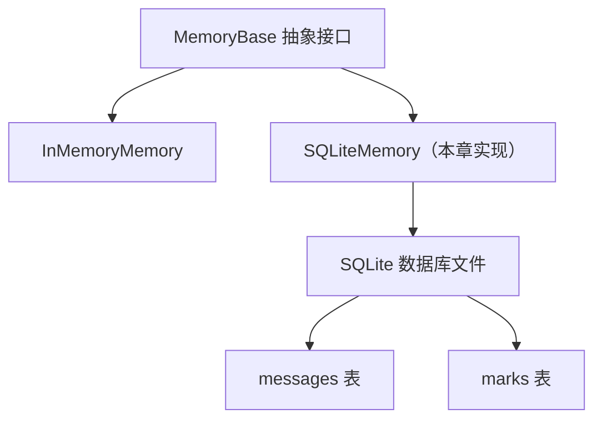
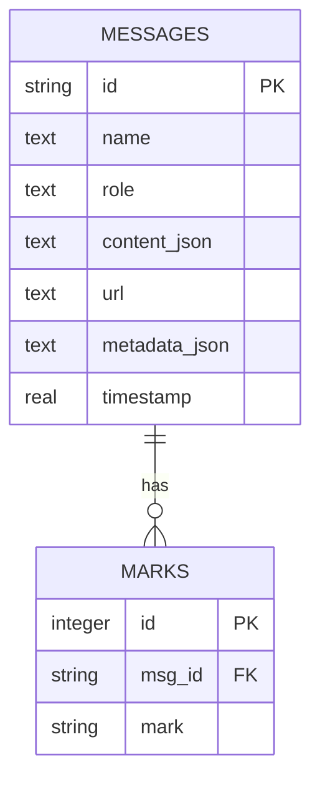
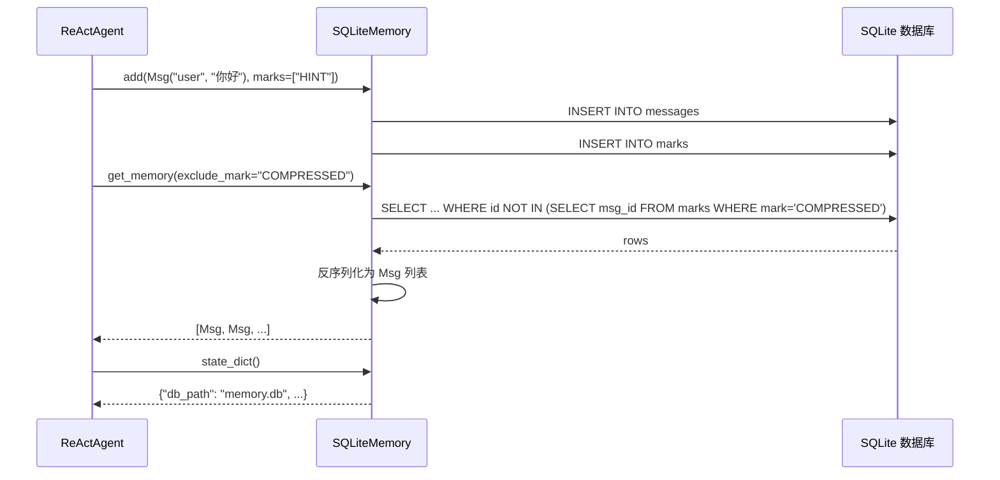

# 第 24 章：造一个新 Memory Backend——SQLite Memory

> **难度**：中等
>
> `InMemoryMemory` 把消息存在内存里，Agent 重启就忘了。你想要一个持久化的 Memory——用 SQLite 存储对话历史，重启后还能恢复。

## 任务目标

实现一个基于 SQLite 的 `MemoryBackend`，满足以下要求：
- 消息持久化到 SQLite 数据库
- 支持 mark 系统（标记和过滤消息）
- 支持序列化/反序列化（`state_dict` / `load_state_dict`）
- 与 `InMemoryMemory` 行为一致，可替换使用



---

## 回顾：MemoryBase 的接口

`MemoryBase`（`_base.py:11`）继承自 `StateModule`，定义了 5 个抽象方法：

```python
# _base.py:32
@abstractmethod
async def add(self, memories, marks=None, **kwargs): ...

# _base.py:50
@abstractmethod
async def delete(self, msg_ids, **kwargs) -> int: ...

# _base.py:92
@abstractmethod
async def size(self) -> int: ...

# _base.py:101
@abstractmethod
async def clear(self): ...

# _base.py:105
@abstractmethod
async def get_memory(self, mark=None, exclude_mark=None, prepend_summary=True, **kwargs) -> list[Msg]: ...
```

还有带默认 `NotImplementedError` 的方法：

```python
# _base.py:66
async def delete_by_mark(self, mark, *args, **kwargs) -> int: ...

# _base.py:134
async def update_messages_mark(self, new_mark, old_mark=None, msg_ids=None) -> int: ...
```

### InMemoryMemory 的参考实现

`InMemoryMemory`（`_in_memory_memory.py:10`）的内部存储结构：

```python
# _in_memory_memory.py:26
self.content: list[tuple[Msg, list[str]]] = []
```

每条记录是 `(Msg, marks)` 元组，`marks` 是标记列表（如 `["HINT", "COMPRESSED"]`）。

`InMemoryMemory` 的序列化（`_in_memory_memory.py:273`）：

```python
def state_dict(self) -> dict:
    return {
        "content": [[msg.to_dict(), marks] for msg, marks in self.content],
    }
```

### StateModule 的序列化机制

`StateModule`（`module/_state_module.py`）提供：
- `state_dict()`（line 49）：遍历 `_module_dict`（子模块）和 `_attribute_dict`（注册属性）生成 dict
- `load_state_dict(state_dict, strict=True)`（line 74）：递归恢复
- `register_state(name, to_json=None, from_json=None)`（line 108）：注册自定义属性

---

## Step 1：设计 SQLite 表结构

### 1.1 表设计



```sql
CREATE TABLE IF NOT EXISTS messages (
    id TEXT PRIMARY KEY,
    name TEXT NOT NULL,
    role TEXT NOT NULL,
    content_json TEXT NOT NULL,
    url TEXT DEFAULT '',
    metadata_json TEXT,
    timestamp REAL NOT NULL
);

CREATE TABLE IF NOT EXISTS marks (
    id INTEGER PRIMARY KEY AUTOINCREMENT,
    msg_id TEXT NOT NULL,
    mark TEXT NOT NULL,
    FOREIGN KEY (msg_id) REFERENCES messages(id)
);

CREATE INDEX IF NOT EXISTS idx_marks_msg_id ON marks(msg_id);
CREATE INDEX IF NOT EXISTS idx_marks_mark ON marks(mark);
```

`content_json` 存储 `Msg.content` 的 JSON 序列化（可能是字符串或 ContentBlock 列表）。

---

## Step 2：逐步实现

### 2.1 类骨架

```python
import json
import time
import sqlite3
from typing import Any

from agentscope.memory._working_memory._base import MemoryBase
from agentscope.message import Msg


class SQLiteMemory(MemoryBase):
    """基于 SQLite 的持久化 Memory。"""

    def __init__(self, db_path: str = "memory.db") -> None:
        super().__init__()
        self.db_path = db_path
        self._init_db()

    def _init_db(self) -> None:
        """初始化数据库表。"""
        conn = sqlite3.connect(self.db_path)
        conn.executescript("""
            CREATE TABLE IF NOT EXISTS messages (
                id TEXT PRIMARY KEY,
                name TEXT NOT NULL,
                role TEXT NOT NULL,
                content_json TEXT NOT NULL,
                url TEXT DEFAULT '',
                metadata_json TEXT,
                timestamp REAL NOT NULL
            );
            CREATE TABLE IF NOT EXISTS marks (
                id INTEGER PRIMARY KEY AUTOINCREMENT,
                msg_id TEXT NOT NULL,
                mark TEXT NOT NULL,
                FOREIGN KEY (msg_id) REFERENCES messages(id)
            );
            CREATE INDEX IF NOT EXISTS idx_marks_msg_id ON marks(msg_id);
            CREATE INDEX IF NOT EXISTS idx_marks_mark ON marks(mark);
        """)
        conn.commit()
        conn.close()
```

### 2.2 实现 add

```python
    async def add(
        self,
        memories: Msg | list[Msg] | None = None,
        marks: list[str] | None = None,
        **kwargs: Any,
    ) -> None:
        """添加消息到数据库。"""
        if memories is None:
            return

        if isinstance(memories, Msg):
            memories = [memories]

        if marks is None:
            marks = []

        conn = sqlite3.connect(self.db_path)
        try:
            for msg in memories:
                # Msg 的 to_dict() 方法（来自 DictMixin）
                msg_dict = msg.to_dict()
                msg_id = msg_dict.get("id", str(time.time()))

                conn.execute(
                    "INSERT OR REPLACE INTO messages VALUES (?, ?, ?, ?, ?, ?, ?)",
                    (
                        msg_id,
                        msg.name,
                        msg.role,
                        json.dumps(msg_dict.get("content", ""), ensure_ascii=False),
                        msg_dict.get("url", ""),
                        json.dumps(msg_dict.get("metadata"), ensure_ascii=False),
                        msg_dict.get("timestamp", time.time()),
                    ),
                )

                # 插入 marks
                for mark in marks:
                    conn.execute(
                        "INSERT INTO marks (msg_id, mark) VALUES (?, ?)",
                        (msg_id, mark),
                    )

            conn.commit()
        finally:
            conn.close()
```

### 2.3 实现 get_memory

```python
    async def get_memory(
        self,
        mark: list[str] | str | None = None,
        exclude_mark: list[str] | str | None = None,
        prepend_summary: bool = True,
        **kwargs: Any,
    ) -> list[Msg]:
        """从数据库检索消息，支持 mark 过滤。"""
        conn = sqlite3.connect(self.db_path)
        conn.row_factory = sqlite3.Row
        try:
            query = "SELECT DISTINCT m.* FROM messages m"
            params = []

            # 按 mark 过滤
            conditions = []
            if mark is not None:
                if isinstance(mark, str):
                    mark = [mark]
                placeholders = ",".join("?" * len(mark))
                query += f" INNER JOIN marks mk ON m.id = mk.msg_id"
                conditions.append(f"mk.mark IN ({placeholders})")
                params.extend(mark)

            if exclude_mark is not None:
                if isinstance(exclude_mark, str):
                    exclude_mark = [exclude_mark]
                placeholders = ",".join("?" * len(exclude_mark))
                conditions.append(
                    f"m.id NOT IN (SELECT msg_id FROM marks WHERE mark IN ({placeholders}))"
                )
                params.extend(exclude_mark)

            if conditions:
                query += " WHERE " + " AND ".join(conditions)

            query += " ORDER BY m.timestamp ASC"

            rows = conn.execute(query, params).fetchall()

            # 反序列化为 Msg
            messages = []
            for row in rows:
                content = json.loads(row["content_json"])
                msg = Msg(
                    name=row["name"],
                    content=content,
                    role=row["role"],
                    url=row["url"] or None,
                    metadata=json.loads(row["metadata_json"]) if row["metadata_json"] else None,
                )
                messages.append(msg)

            return messages
        finally:
            conn.close()
```

### 2.4 实现其他方法

```python
    async def delete(self, msg_ids: list[str], **kwargs) -> int:
        """按 ID 删除消息。"""
        conn = sqlite3.connect(self.db_path)
        try:
            placeholders = ",".join("?" * len(msg_ids))
            conn.execute(f"DELETE FROM marks WHERE msg_id IN ({placeholders})", msg_ids)
            cursor = conn.execute(
                f"DELETE FROM messages WHERE id IN ({placeholders})", msg_ids
            )
            conn.commit()
            return cursor.rowcount
        finally:
            conn.close()

    async def delete_by_mark(self, mark: str, *args, **kwargs) -> int:
        """按 mark 删除消息。"""
        conn = sqlite3.connect(self.db_path)
        try:
            msg_ids = conn.execute(
                "SELECT msg_id FROM marks WHERE mark = ?", (mark,)
            ).fetchall()
            msg_ids = [row[0] for row in msg_ids]
            if msg_ids:
                return await self.delete(msg_ids)
            return 0
        finally:
            conn.close()

    async def size(self) -> int:
        """返回消息总数。"""
        conn = sqlite3.connect(self.db_path)
        try:
            row = conn.execute("SELECT COUNT(*) FROM messages").fetchone()
            return row[0]
        finally:
            conn.close()

    async def clear(self) -> None:
        """清空所有消息。"""
        conn = sqlite3.connect(self.db_path)
        try:
            conn.execute("DELETE FROM marks")
            conn.execute("DELETE FROM messages")
            conn.commit()
        finally:
            conn.close()
```

---

## Step 3：序列化支持

为了让 `AgentBase.state_dict()` 能序列化 `SQLiteMemory`，需要实现序列化方法：

```python
    def state_dict(self) -> dict:
        """序列化：保存数据库路径和摘要。"""
        return {
            "db_path": self.db_path,
            "_compressed_summary": self._compressed_summary,
        }

    def load_state_dict(self, state_dict: dict, strict: bool = True) -> None:
        """反序列化：连接到同一个数据库。"""
        self.db_path = state_dict.get("db_path", self.db_path)
        self._compressed_summary = state_dict.get("_compressed_summary", "")
        self._init_db()
```

注意：`SQLiteMemory` 不需要在 `state_dict` 中保存所有消息——消息已经在数据库里了。只需要保存数据库路径，恢复时重新连接即可。这是 SQLite 方案相比内存方案的核心优势。

`_compressed_summary` 是 `MemoryBase.__init__` 中通过 `register_state` 注册的属性（`_base.py:22`），需要在序列化时保留。

---

## Step 4：测试验证

### 4.1 单元测试

```python
import asyncio
import os
import pytest
from agentscope.message import Msg


@pytest.fixture
def memory():
    db_path = "test_memory.db"
    mem = SQLiteMemory(db_path=db_path)
    yield mem
    os.remove(db_path)


async def test_add_and_get(memory):
    msg = Msg("user", "你好", "user")
    await memory.add(msg)

    result = await memory.get_memory()
    assert len(result) == 1
    assert result[0].content == "你好"
    assert result[0].name == "user"


async def test_mark_filter(memory):
    await memory.add(Msg("user", "普通消息", "user"))
    await memory.add(Msg("system", "提示消息", "system"), marks=["HINT"])

    all_msgs = await memory.get_memory()
    assert len(all_msgs) == 2

    hinted = await memory.get_memory(mark="HINT")
    assert len(hinted) == 1
    assert hinted[0].content == "提示消息"

    no_hint = await memory.get_memory(exclude_mark="HINT")
    assert len(no_hint) == 1
    assert no_hint[0].content == "普通消息"


async def test_delete_by_mark(memory):
    await memory.add(Msg("system", "临时", "system"), marks=["TEMP"])
    await memory.add(Msg("user", "永久", "user"))

    await memory.delete_by_mark("TEMP")
    result = await memory.get_memory()
    assert len(result) == 1
    assert result[0].content == "永久"


async def test_clear(memory):
    await memory.add(Msg("user", "消息1", "user"))
    await memory.add(Msg("user", "消息2", "user"))
    await memory.clear()
    assert await memory.size() == 0
```

### 4.2 与 InMemoryMemory 的对比测试

```python
from agentscope.memory import InMemoryMemory


async def test_parity_with_in_memory():
    """SQLiteMemory 和 InMemoryMemory 行为应一致。"""
    sqlite_mem = SQLiteMemory(db_path="test_parity.db")
    in_mem = InMemoryMemory()

    msgs = [Msg("user", f"消息{i}", "user") for i in range(5)]

    for msg in msgs:
        await sqlite_mem.add(msg)
        await in_mem.add(msg)

    assert await sqlite_mem.size() == await in_mem.size()

    sqlite_all = await sqlite_mem.get_memory()
    in_mem_all = await in_mem.get_memory()
    assert len(sqlite_all) == len(in_mem_all)

    # 清理
    os.remove("test_parity.db")
```

---

## 设计一瞥

> **设计一瞥**：SQLite vs Redis，该用哪个？
> AgentScope 已经提供了 `RedisMemory`。SQLite 的优势是**零依赖**——不需要安装 Redis 服务器，一个 `.db` 文件就是数据库。适合开发环境和小规模部署。Redis 的优势是**并发性能**——支持多进程同时读写，适合生产环境。
> `MemoryBase` 的抽象让你可以在两者之间无缝切换——上层代码只调用 `add`/`get_memory`，不关心底层存储。

---

## 完整流程图



---

## 试一试：添加模糊搜索

这个练习不需要 API key。

**目标**：给 `SQLiteMemory` 添加一个按内容关键词搜索的方法。

**步骤**：

1. 在 `SQLiteMemory` 中添加方法：

```python
async def search(self, keyword: str, limit: int = 10) -> list[Msg]:
    """按关键词搜索消息。"""
    conn = sqlite3.connect(self.db_path)
    conn.row_factory = sqlite3.Row
    try:
        rows = conn.execute(
            "SELECT * FROM messages WHERE content_json LIKE ? ORDER BY timestamp DESC LIMIT ?",
            (f"%{keyword}%", limit),
        ).fetchall()
        # 反序列化为 Msg（复用 get_memory 中的逻辑）
        ...
    finally:
        conn.close()
```

2. 测试：

```python
async def test_search():
    mem = SQLiteMemory(db_path="test_search.db")
    await mem.add(Msg("user", "北京天气晴朗", "user"))
    await mem.add(Msg("user", "上海下雨了", "user"))
    await mem.add(Msg("user", "北京空气质量良好", "user"))

    results = await mem.search("北京")
    assert len(results) == 2

    os.remove("test_search.db")
```

3. **进阶**：考虑 SQLite 的 FTS5（全文搜索）扩展，对大量消息做高效检索。

---

## PR 检查清单

提交新 Memory Backend 的 PR 时：

- [ ] **继承 MemoryBase**：正确实现所有抽象方法
- [ ] **mark 系统**：`add` 支持 marks，`get_memory` 支持 mark 和 exclude_mark 过滤
- [ ] **序列化**：`state_dict` / `load_state_dict` 正确保存和恢复状态
- [ ] **对比测试**：与 `InMemoryMemory` 的行为一致
- [ ] **`__init__.py` 导出**：在 `memory/__init__.py` 中导出
- [ ] **Docstring**：所有公共方法按项目规范写 docstring
- [ ] **pre-commit 通过**

---

## 检查点

你现在理解了：

- **MemoryBase** 的 5 个抽象方法：`add`、`delete`、`size`、`clear`、`get_memory`
- **InMemoryMemory** 用 `list[tuple[Msg, list[str]]]` 存储，SQLite 用关系表
- **mark 系统**：通过 marks 表关联消息和标记，支持过滤
- **序列化差异**：内存方案需要序列化所有数据，SQLite 只需保存路径
- **StateModule** 的 `register_state` 机制用于注册自定义属性

**自检练习**：

1. 如果 `SQLiteMemory` 不实现 `state_dict` / `load_state_dict`，`agent.state_dict()` 会怎样？（提示：看 `StateModule.state_dict` 如何处理未注册的属性）
2. 为什么 `delete_by_mark` 不是抽象方法？（提示：看 `_base.py:66` 的默认实现方式）

---

## 下一章预告

我们造了 Tool、Model、Memory 三个齿轮。下一章，我们造最复杂的一个——**新的 Agent 类型**。实现一个 Plan-Execute Agent，让模型先做计划再执行。
