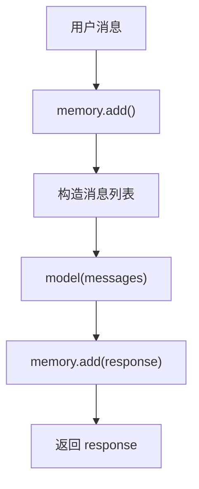
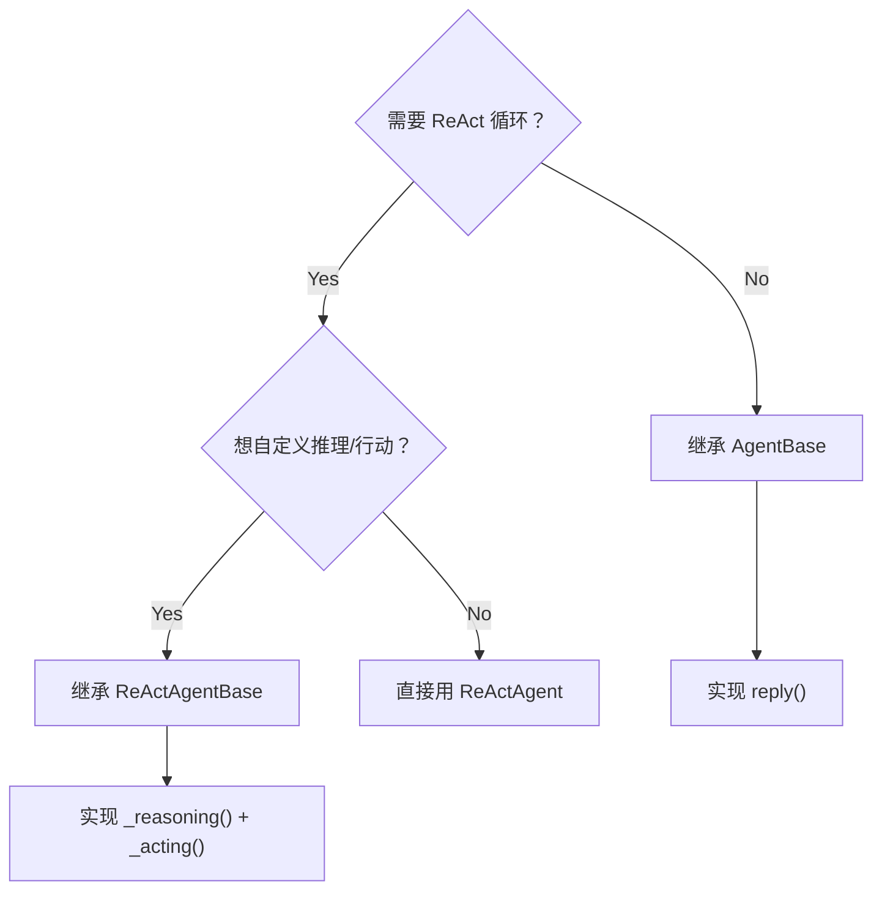

# 第 25 章：构建自定义 Agent——扩展 AgentBase

> **难度**：进阶
>
> ReAct 模式（推理→行动→观察循环）是 AgentScope 的默认推理模式。但如果你想要不同的模式——比如纯规划模式、单步执行模式——怎么写？

## 回顾：Agent 的继承体系

```
AgentBase                   # 核心基类
  ├── ReActAgentBase        # ReAct 框架（抽象）
  │     └── ReActAgent      # ReAct 具体实现
  ├── UserAgent             # 用户输入
  ├── A2AAgent              # A2A 协议
  └── RealtimeAgent         # 语音交互
```

构建自定义 Agent 有两种路径：

1. **继承 `ReActAgentBase`**：复用 ReAct 框架，自定义推理/行动逻辑
2. **直接继承 `AgentBase`**：完全自定义推理模式

---

## 路径一：继承 AgentBase

`AgentBase`（`_agent_base.py:30`）只要求实现 `reply` 方法：

```python
# _agent_base.py:197
async def reply(self, *args, **kwargs) -> Msg:
```

### 构建一个简单的 Echo Agent

```python
"""Echo Agent：直接返回用户的消息"""
from agentscope.agent import AgentBase
from agentscope.message import Msg


class EchoAgent(AgentBase):
    """收到消息后原样返回。"""

    def __init__(self, name: str):
        super().__init__(name=name)

    async def reply(self, msg: Msg | None = None) -> Msg:
        if msg is None:
            content = "（无消息）"
        elif isinstance(msg.content, str):
            content = f"Echo: {msg.content}"
        else:
            content = "Echo: [复杂内容]"

        return Msg(name=self.name, content=content, role="assistant")
```

使用：

```python
import asyncio

agent = EchoAgent(name="echo")
msg = Msg(name="user", content="你好", role="user")
response = asyncio.run(agent(msg))
print(response.content)  # "Echo: 你好"
```

### 构建一个带模型的单步 Agent

不使用 ReAct 循环，只做一次模型调用：

```python
"""单步 Agent：调用一次模型就返回"""
from agentscope.agent import AgentBase
from agentscope.message import Msg
from agentscope.memory import InMemoryMemory


class SingleStepAgent(AgentBase):
    """不做循环，直接调用一次模型返回结果。"""

    def __init__(self, name: str, model, sys_prompt: str = ""):
        super().__init__(name=name)
        self.model = model
        self.sys_prompt = sys_prompt
        self.memory = InMemoryMemory()  # 自动被 StateModule 追踪

    async def reply(self, msg: Msg | None = None) -> Msg:
        # 1. 把用户消息加入记忆
        if msg is not None:
            await self.memory.add(msg)

        # 2. 构造消息列表
        messages = []
        if self.sys_prompt:
            messages.append(Msg("system", self.sys_prompt, "system"))
        messages.extend(await self.memory.get_memory())

        # 3. 调用模型
        response = await self.model(messages)

        # 4. 把回复加入记忆
        await self.memory.add(response)

        return response
```



---

## 路径二：继承 ReActAgentBase

`ReActAgentBase`（`_react_agent_base.py:12`）要求实现 2 个抽象方法：

```python
# _react_agent_base.py:104-114
@abstractmethod
async def _reasoning(self, *args, **kwargs) -> Any:
    """推理过程"""

@abstractmethod
async def _acting(self, *args, **kwargs) -> Any:
    """行动过程"""
```

### 构建一个 Plan-Execute Agent

不同于 ReAct（推理和行动交替），Plan-Execute 模式先规划所有步骤，再逐一执行：

```python
"""Plan-Execute Agent：先规划后执行"""
from agentscope.agent import ReActAgentBase
from agentscope.message import Msg


class PlanExecuteAgent(ReActAgentBase):
    """先规划所有步骤，然后按计划执行。"""

    async def _reasoning(self, messages, **kwargs):
        # 一次性生成完整计划
        prompt = "请制定一个执行计划，用 JSON 列表返回步骤。"
        response = await self.model(messages + [Msg("user", prompt, "user")])
        return response

    async def _acting(self, plan, **kwargs):
        # 按计划逐步执行
        results = []
        for step in plan:
            result = await self.toolkit.call_tool_function(step)
            results.append(result)
        return results
```

注意：继承 `ReActAgentBase` 会自动获得 reasoning/acting 的 Hook 能力（第 21-31 行定义的 6 个 Hook 点）。

---

## 选择路径的决策树



| 路径 | 实现复杂度 | 适合场景 |
|------|-----------|----------|
| 继承 `AgentBase` | 低 | 单步、管道、简单逻辑 |
| 继承 `ReActAgentBase` | 中 | 自定义 ReAct 变体 |
| 使用 `ReActAgent` | 无 | 标准推理+工具场景 |

AgentScope 官方文档的 Building Blocks > Agent 页面展示了 `ReActAgent` 和 `UserAgent` 的使用方法。本章解释了如何通过继承 `AgentBase` 或 `ReActAgentBase` 创建自定义 Agent——这是框架最核心的扩展点。

AgentScope 1.0 论文对 Agent 的抽象设计说明是：

> "we ground agent behaviors in the ReAct paradigm and offer advanced agent-level infrastructure based on a systematic asynchronous design"
>
> — AgentScope 1.0: A Comprehensive Framework for Building Agentic Applications, arXiv:2508.16279, Section 2.2

论文中的"systematic asynchronous design"体现在 `AgentBase.__call__` 的 Hook 系统（元类自动包装）和 `ReActAgentBase` 的 6 个 Hook 点（pre/post reasoning、pre/post acting 等）。继承 `ReActAgentBase` 可以复用这套基础设施，只自定义推理和行动的具体逻辑。

---

## 试一试：创建并测试 EchoAgent

**步骤**：

1. 创建测试脚本：

```python
import asyncio
from agentscope.agent import AgentBase
from agentscope.message import Msg


class EchoAgent(AgentBase):
    def __init__(self, name: str):
        super().__init__(name=name)

    async def reply(self, msg: Msg | None = None) -> Msg:
        content = msg.content if msg and isinstance(msg.content, str) else "..."
        return Msg(name=self.name, content=f"Echo: {content}", role="assistant")


async def main():
    agent = EchoAgent(name="echo")

    # 直接调用 reply（跳过 __call__ 的广播逻辑）
    msg = Msg(name="user", content="Hello!", role="user")
    response = await agent.reply(msg)
    print(response.content)

    # 通过 __call__ 调用（包含广播）
    response2 = await agent(msg)
    print(response2.content)

asyncio.run(main())
```

2. 观察：`reply` 和 `__call__` 的返回值一样，但 `__call__` 会触发广播。

---

## 检查点

- 继承 `AgentBase` 只需实现 `reply()` 方法
- 继承 `ReActAgentBase` 需实现 `_reasoning()` 和 `_acting()`
- `AgentBase.__call__` 在 reply 后自动广播和触发 Hook
- 选择路径取决于定制深度：单步用 AgentBase，ReAct 变体用 ReActAgentBase

---

## 下一章预告

单个 Agent 的扩展掌握了。多个 Agent 怎么组合编排？下一章我们看 Pipeline 的构建。
