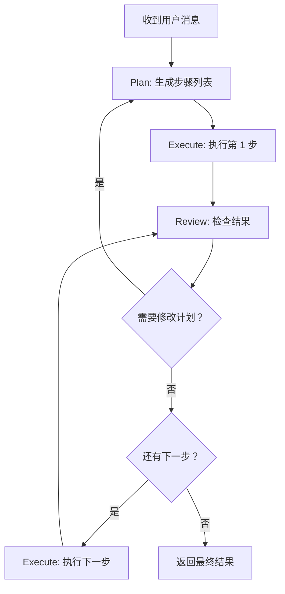
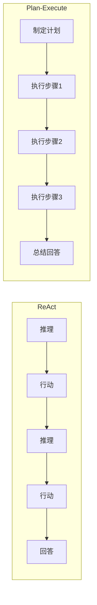

# 第 25 章：造一个新 Agent 类型——Plan-Execute Agent

> **难度**：进阶
>
> ReAct Agent 是"边想边做"。但有些复杂任务需要"先想清楚再动手"——先制定计划，再逐步执行。这就是 Plan-Execute 模式。

## 任务目标

实现一个 Plan-Execute Agent，工作流程为：
1. **Plan 阶段**：分析任务，生成步骤列表
2. **Execute 阶段**：逐步执行每个步骤
3. **Review 阶段**：检查执行结果，决定是否需要修改计划



---

## 回顾：AgentBase 的接口

`AgentBase`（`_agent_base.py`）的核心方法：

```python
# _agent_base.py:197
async def reply(self, *args, **kwargs) -> Msg:
    """子类需要覆盖此方法，实现 Agent 的核心逻辑。"""
    raise NotImplementedError(...)

# _agent_base.py:448
async def __call__(self, msg=None, **kwargs) -> Msg:
    """入口方法：Hook 前置 → reply() → Hook 后置 → 广播"""
```

`reply` 不是 `@abstractmethod`——它直接 `raise NotImplementedError`。子类**必须覆盖**它。

### ReActAgentBase 中间层

`ReActAgentBase`（`_react_agent_base.py`）在 `AgentBase` 和 `ReActAgent` 之间提供了：
- `_reasoning`、`_acting`、`_summarizing` 的骨架方法
- `memory`、`model`、`formatter`、`toolkit` 的统一管理
- `max_iters` 参数

我们的 `PlanExecuteAgent` 可以直接继承 `AgentBase`，因为 Plan-Execute 的循环结构和 ReAct 不同。

### 已有 Agent 类型

`src/agentscope/agent/` 目录下：

| 文件 | Agent 类型 | 特点 |
|------|-----------|------|
| `_agent_base.py` | AgentBase | 所有 Agent 的基类 |
| `_react_agent.py` | ReActAgent | 推理-行动循环 |
| `_user_agent.py` | UserAgent | 人类输入代理 |
| `_a2a_agent.py` | A2AAgent | Agent-to-Agent 协议 |
| `_realtime_agent.py` | RealtimeAgent | 实时语音交互 |

---

## Step 1：设计方案

### 1.1 Plan-Execute vs ReAct



ReAct 是**交错**的（推理-行动-推理-行动...），Plan-Execute 是**分离**的（先计划，再执行）。

### 1.2 类结构

```python
class PlanExecuteAgent(AgentBase):
    """Plan-Execute 模式的 Agent。"""

    # 新增属性
    plan_prompt: str       # 计划生成的提示
    execute_prompt: str    # 执行步骤的提示
    review_prompt: str     # 审查结果的提示
    max_plan_revisions: int  # 最大计划修改次数
```

---

## Step 2：逐步实现

### 2.1 类定义和初始化

```python
import json
from typing import Any

from agentscope.agent._agent_base import AgentBase
from agentscope.message import Msg, TextBlock, ToolUseBlock


class PlanExecuteAgent(AgentBase):
    """Plan-Execute 模式的 Agent。

    先制定计划，再逐步执行每个步骤，适合复杂多步任务。

    Args:
        name (`str`): Agent 名称
        sys_prompt (`str`): 系统提示
        model: 模型实例（ChatModelBase）
        formatter: 格式转换器
        toolkit: 工具箱
        memory: 工作记忆
        max_plan_revisions (`int`, optional): 最大计划修改次数，默认 3
    """

    def __init__(
        self,
        name: str,
        sys_prompt: str = "你是一个有帮助的助手。",
        model=None,
        formatter=None,
        toolkit=None,
        memory=None,
        max_plan_revisions: int = 3,
        **kwargs: Any,
    ) -> None:
        super().__init__(name=name, **kwargs)
        self.sys_prompt = sys_prompt
        self.model = model
        self.formatter = formatter
        self.toolkit = toolkit
        self.memory = memory
        self.max_plan_revisions = max_plan_revisions

        self._plan: list[dict] = []  # 当前计划
        self._current_step: int = 0  # 当前步骤索引
        self._results: list[dict] = []  # 执行结果
```

### 2.2 reply 方法

```python
    async def reply(self, msg: Msg | list[Msg] | None = None, **kwargs) -> Msg:
        """Plan-Execute 的主循环。"""
        # 1. 记录输入
        if msg is not None:
            if isinstance(msg, Msg):
                msg = [msg]
            for m in msg:
                await self.memory.add(m)

        # 2. Plan 阶段
        self._plan = await self._plan_phase()
        self._current_step = 0
        self._results = []

        # 3. Execute + Review 循环
        plan_revisions = 0
        while self._current_step < len(self._plan):
            # 执行当前步骤
            step_result = await self._execute_step(self._plan[self._current_step])
            self._results.append(step_result)

            # Review
            review = await self._review_phase()
            if review.get("needs_revision") and plan_revisions < self.max_plan_revisions:
                # 修改计划
                self._plan = await self._plan_phase(is_revision=True)
                plan_revisions += 1
            else:
                self._current_step += 1

        # 4. 总结阶段
        final_msg = await self._summarize_results()
        return final_msg
```

### 2.3 Plan 阶段

```python
    async def _plan_phase(self, is_revision: bool = False) -> list[dict]:
        """生成或修改计划。"""
        if is_revision:
            prompt = (
                "根据执行结果，修改你的计划。\n"
                f"已完成步骤: {self._results}\n"
                "请输出修正后的步骤列表。"
            )
        else:
            prompt = (
                "分析用户的请求，制定一个执行计划。\n"
                "每个步骤应该包含：step（步骤描述）、tool（需要用的工具）、"
                "reason（为什么需要这一步）。\n"
                "以 JSON 数组格式输出。"
            )

        plan_msg = Msg("system", prompt, "system")
        await self.memory.add(plan_msg)

        # 调用模型
        formatted = await self.formatter.format([
            Msg("system", self.sys_prompt, "system"),
            *await self.memory.get_memory(),
        ])
        response = await self.model(formatted, tools=self.toolkit.get_json_schemas() if self.toolkit else None)

        # 解析计划（从模型响应中提取 JSON）
        plan_text = ""
        for block in response.content:
            if isinstance(block, dict) and block.get("type") == "text":
                plan_text += block.get("text", "")

        try:
            # 尝试从响应中解析 JSON 数组
            start = plan_text.find("[")
            end = plan_text.rfind("]") + 1
            if start >= 0 and end > start:
                plan = json.loads(plan_text[start:end])
            else:
                plan = [{"step": plan_text, "tool": None, "reason": "直接回答"}]
        except json.JSONDecodeError:
            plan = [{"step": plan_text, "tool": None, "reason": "直接回答"}]

        await self.memory.add(Msg("assistant", plan_text, "assistant"))
        return plan
```

### 2.4 Execute 阶段

```python
    async def _execute_step(self, step: dict) -> dict:
        """执行计划中的一个步骤。"""
        step_prompt = f"执行步骤: {step.get('step', '')}\n原因: {step.get('reason', '')}"
        await self.memory.add(Msg("system", step_prompt, "system"))

        formatted = await self.formatter.format([
            Msg("system", self.sys_prompt, "system"),
            *await self.memory.get_memory(),
        ])
        tools = self.toolkit.get_json_schemas() if self.toolkit else None
        response = await self.model(formatted, tools=tools)

        result_text = ""
        tool_results = []

        for block in response.content:
            if isinstance(block, dict):
                if block.get("type") == "text":
                    result_text += block.get("text", "")
                elif block.get("type") == "tool_use":
                    # 执行工具调用
                    tool_res = self.toolkit.call_tool_function(block)
                    async for chunk in tool_res:
                        for c in chunk.content:
                            tool_results.append(c.get("text", ""))

        if tool_results:
            result_text += "\n工具结果: " + "\n".join(tool_results)

        await self.memory.add(Msg("assistant", result_text, "assistant"))
        return {"step": step, "result": result_text}
```

### 2.5 Review 阶段

```python
    async def _review_phase(self) -> dict:
        """审查当前步骤的执行结果。"""
        review_prompt = (
            f"检查步骤 '{self._plan[self._current_step].get('step', '')}' 的执行结果。\n"
            f"结果: {self._results[-1].get('result', '')}\n"
            "回答: 结果是否满意？是否需要修改后续计划？\n"
            '以 JSON 格式回答: {"satisfied": true/false, "needs_revision": true/false, "reason": "..."}'
        )
        await self.memory.add(Msg("system", review_prompt, "system"))

        formatted = await self.formatter.format([
            Msg("system", self.sys_prompt, "system"),
            *await self.memory.get_memory(),
        ])
        response = await self.model(formatted)

        review_text = ""
        for block in response.content:
            if isinstance(block, dict) and block.get("type") == "text":
                review_text += block.get("text", "")

        try:
            start = review_text.find("{")
            end = review_text.rfind("}") + 1
            if start >= 0 and end > start:
                return json.loads(review_text[start:end])
        except json.JSONDecodeError:
            pass

        return {"satisfied": True, "needs_revision": False, "reason": "解析失败，默认继续"}
```

### 2.6 总结阶段

```python
    async def _summarize_results(self) -> Msg:
        """总结所有执行结果，返回最终回复。"""
        summary_prompt = (
            "所有步骤已执行完毕。以下是执行结果：\n"
            + "\n".join(
                f"- {r['step'].get('step', '')}: {r.get('result', '')}"
                for r in self._results
            )
            + "\n\n请给出最终回答。"
        )

        final_msgs = [
            Msg("system", self.sys_prompt, "system"),
            Msg("user", summary_prompt, "user"),
        ]
        formatted = await self.formatter.format(final_msgs)
        response = await self.model(formatted)

        result_text = ""
        for block in response.content:
            if isinstance(block, dict) and block.get("type") == "text":
                result_text += block.get("text", "")

        final_msg = Msg(self.name, result_text, "assistant")
        await self.memory.add(final_msg)
        return final_msg
```

---

## Step 3：使用 PlanExecuteAgent

```python
import agentscope
from agentscope.agent import AgentBase
from agentscope.model import OpenAIChatModel
from agentscope.formatter import OpenAIChatFormatter
from agentscope.tool import Toolkit
from agentscope.memory import InMemoryMemory

agentscope.init(project="plan-execute-demo")

model = OpenAIChatModel(model_name="gpt-4o")
toolkit = Toolkit()
toolkit.register_tool_function(search_web)
toolkit.register_tool_function(analyze_data)

agent = PlanExecuteAgent(
    name="planner",
    sys_prompt="你是一个数据分析助手。先制定计划，再逐步执行。",
    model=model,
    formatter=OpenAIChatFormatter(),
    toolkit=toolkit,
    memory=InMemoryMemory(),
    max_plan_revisions=3,
)

# result = await agent(Msg("user", "分析最近的销售数据趋势", "user"))
```

---

## 设计一瞥

> **设计一瞥**：为什么不继承 ReActAgentBase？
> `ReActAgentBase` 提供了 `_reasoning`、`_acting`、`_summarizing` 的骨架，但它的循环结构是固定的（推理-行动交替）。Plan-Execute 模式的循环结构不同（计划-执行-审查），强行复用 ReActAgentBase 的骨架会导致代码更复杂而不是更简单。
> 直接继承 `AgentBase` 意味着你需要自己管理 `model`、`formatter`、`memory` 等属性，但换来了完全的循环控制自由。
> 这是**继承 vs 组合**的经典权衡。详见卷四第 31 章。

---

## 试一试：添加计划可视化

这个练习不需要 API key（可以用 print 模拟）。

**目标**：在 Plan-Execute 的每个阶段打印当前状态。

**步骤**：

1. 在 `_plan_phase` 中添加：

```python
print(f"\n{'='*50}")
print(f"📋 计划（{'修改' if is_revision else '新建'}）：")
for i, step in enumerate(plan):
    marker = "→" if i == self._current_step else " "
    print(f"  {marker} 步骤 {i+1}: {step.get('step', '')}")
```

2. 在 `_execute_step` 中添加：

```python
print(f"\n▶ 执行步骤 {self._current_step + 1}/{len(self._plan)}")
print(f"  工具: {step.get('tool', '无')}")
```

3. 在 `_review_phase` 中添加：

```python
print(f"✓ 审查: {'满意' if review.get('satisfied') else '需要修改'}")
if review.get("needs_revision"):
    print(f"  原因: {review.get('reason', '')}")
```

4. 运行 Agent，观察 Plan → Execute → Review 的完整流程输出。

---

## PR 检查清单

提交新 Agent 类型的 PR 时：

- [ ] **继承 AgentBase**：正确覆盖 `reply` 方法
- [ ] **`__call__` 不需要覆盖**：AgentBase 的 `__call__` 已处理 Hook 和广播
- [ ] **memory 管理**：`reply` 中正确 add/get 消息
- [ ] **模型调用**：通过 formatter.format → model 的标准流程
- [ ] **工具调用**：正确处理 ToolUseBlock → call_tool_function
- [ ] **`__init__.py` 导出**：在 `agent/__init__.py` 中导出
- [ ] **测试**：用 Mock 模型测试 plan/execute/review 三个阶段
- [ ] **Docstring**：所有公共方法按项目规范

---

## 检查点

你现在理解了：

- **AgentBase.reply** 是唯一需要覆盖的方法，实现 Agent 的核心逻辑
- **Plan-Execute** 模式：Plan（制定计划）→ Execute（逐步执行）→ Review（审查结果）
- 与 **ReAct** 的区别：Plan-Execute 是"先计划再执行"，ReAct 是"边想边做"
- 直接继承 `AgentBase`（而非 `ReActAgentBase`）可以获得完全的循环控制自由
- **JSON 解析**：从模型文本响应中提取结构化数据是一个常见需求

**自检练习**：

1. 如果模型在 Plan 阶段返回的不是合法 JSON，代码会怎么处理？（提示：看 `_plan_phase` 的 try/except）
2. `PlanExecuteAgent` 的 `reply` 方法中，哪些阶段会调用工具？（提示：只有 Execute 阶段）

---

## 下一章预告

我们造了 Tool、Model、Memory、Agent 四个齿轮。下一章，我们接入一个**外部工具协议**——MCP Server，让 Agent 可以调用本地 MCP 服务提供的工具。
