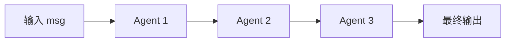
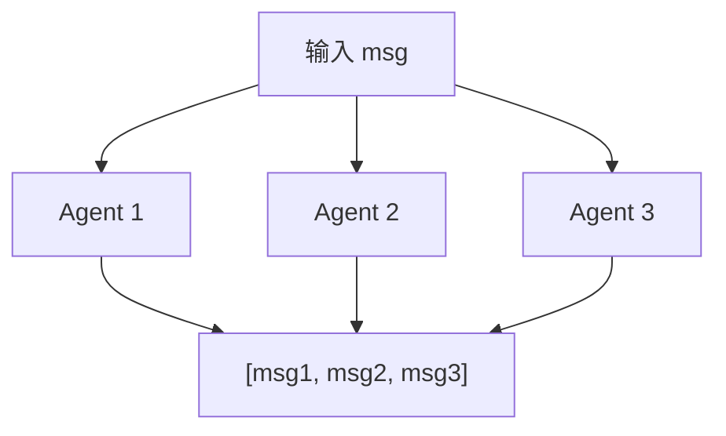
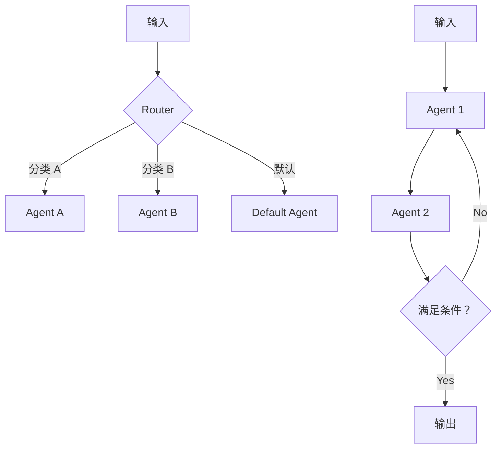

# 第 26 章：Pipeline 编排——多 Agent 的组合模式

> **难度**：中等
>
> 单个 Agent 能力有限。三个 Agent 怎么协作——是顺序执行、并行执行，还是自由讨论？Pipeline 就是编排多 Agent 的工具。

## 内置的两种 Pipeline

AgentScope 提供了两种基本的 Pipeline 模式，都在 `src/agentscope/pipeline/` 下。

### SequentialPipeline：顺序执行

```python
# _functional.py:10-44
async def sequential_pipeline(agents, msg=None):
    for agent in agents:
        msg = await agent(msg)
    return msg
```

极简：每个 Agent 的输出是下一个 Agent 的输入。



使用方式：

```python
from agentscope.pipeline import SequentialPipeline

pipeline = SequentialPipeline([agent1, agent2, agent3])
result = await pipeline(msg)
```

类封装（`_class.py:10`）只是对函数式 API 的简单包装。

### FanoutPipeline：并行分发

```python
# _functional.py:47-104
async def fanout_pipeline(agents, msg=None, enable_gather=True):
    if enable_gather:
        tasks = [asyncio.create_task(agent(deepcopy(msg))) for agent in agents]
        return await asyncio.gather(*tasks)
    else:
        return [await agent(deepcopy(msg)) for agent in agents]
```

同一个消息分发给所有 Agent，收集所有响应。



注意 `deepcopy`——每个 Agent 收到消息的副本，互不干扰。

### MsgHub：自由讨论

第三种模式是 `MsgHub`（`_msghub.py`），在第 19 章详细讲过：

```python
from agentscope.pipeline import MsgHub

async with MsgHub(participants=[agent1, agent2, agent3]):
    await agent1()
    await agent2()
    # 每个 Agent 的输出自动广播给其他 Agent
```

---

## 组合模式

基本模式可以组合出更复杂的编排：

### 模式一：MapReduce

多个 Agent 并行处理，结果汇总：

```python
async def map_reduce(agents, msg, reducer):
    """并行处理 + 汇总"""
    from agentscope.pipeline import FanoutPipeline

    fanout = FanoutPipeline(agents)
    results = await fanout(msg)

    # 汇总结果
    combined = "\n".join(r.content for r in results if isinstance(r.content, str))
    return await reducer(Msg(name="system", content=combined, role="user"))
```

### 模式二：Router

根据条件选择不同的 Agent：

```python
async def router(msg, agents_dict, classifier):
    """先分类，再路由到对应 Agent"""
    category = await classifier(msg)

    agent = agents_dict.get(category.content)
    if agent is None:
        agent = agents_dict["default"]

    return await agent(msg)
```

### 模式三：Loop

循环执行直到满足条件：

```python
async def loop_pipeline(agents, msg, max_rounds=5):
    """循环执行直到 Agent 说 STOP"""
    for _ in range(max_rounds):
        for agent in agents:
            msg = await agent(msg)

        # 检查退出条件
        if isinstance(msg.content, str) and "STOP" in msg.content:
            break

    return msg
```



---

## stream_printing_messages：流式消息收集

`_functional.py:107` 提供了一个特殊的 Pipeline 工具——收集 Agent 的打印消息流：

```python
# _functional.py:107-188 (简化)
async def stream_printing_messages(agents, coroutine_task):
    queue = asyncio.Queue()
    for agent in agents:
        agent.set_msg_queue_enabled(True, queue)  # 开启消息队列

    task = asyncio.create_task(coroutine_task)

    while True:
        msg = await queue.get()
        if msg == "[END]":
            break
        yield msg  # 逐条 yield 给调用者
```

这让你可以在 Agent 执行过程中实时获取中间输出，而不需要等整个执行完成。

> **官方文档对照**：本文对应 [Building Blocks > Multi-Agent Collaboration](https://docs.agentscope.io/building-blocks/multi-agent-collaboration)。官方文档展示了 SequentialPipeline、FanoutPipeline 和 MsgHub 的使用方法，本章补充了组合模式（MapReduce、Router、Loop）的实现思路。
>
> **推荐阅读**：[AgentScope 1.0 论文](https://arxiv.org/pdf/2508.16279) 第 2.3 节讨论了多 Agent 协作的编排模式。

---

## 试一试：组合 Sequential 和 Fanout

**目标**：先并行分发，再顺序处理。

**步骤**：

1. 创建测试脚本（使用简单的 EchoAgent，不需要 API key）：

```python
import asyncio
from agentscope.agent import AgentBase
from agentscope.message import Msg
from agentscope.pipeline import FanoutPipeline, SequentialPipeline


class TagAgent(AgentBase):
    def __init__(self, name, tag):
        super().__init__(name=name)
        self.tag = tag

    async def reply(self, msg=None):
        content = msg.content if msg and isinstance(msg.content, str) else ""
        return Msg(name=self.name, content=f"[{self.tag}] {content}", role="assistant")


async def main():
    # Fanout: 分发给三个 Agent
    fanout = FanoutPipeline([
        TagAgent("A", "翻译"),
        TagAgent("B", "总结"),
        TagAgent("C", "分析"),
    ])

    # Sequential: 两个 Agent 依次处理
    sequential = SequentialPipeline([
        TagAgent("D", "审校"),
        TagAgent("E", "输出"),
    ])

    msg = Msg("user", "这是一段测试文本", "user")

    # 并行处理
    results = await fanout(msg)
    for r in results:
        print(r.content)

    # 顺序处理
    final = await sequential(msg)
    print(f"\n最终: {final.content}")

asyncio.run(main())
```

2. 观察输出：Fanout 的三个 Agent 并行返回，Sequential 的两个 Agent 依次处理。

---

## 检查点

- **SequentialPipeline**：前一个的输出是后一个的输入
- **FanoutPipeline**：同一消息分发给所有 Agent，支持并行（`asyncio.gather`）
- **MsgHub**：Agent 之间自由讨论，自动广播
- 可以组合出 MapReduce、Router、Loop 等模式
- `stream_printing_messages` 实时收集 Agent 的中间输出

---

## 下一章预告

写完代码需要测试。Agent 和模型的测试有什么特殊之处？下一章我们看测试模式。
