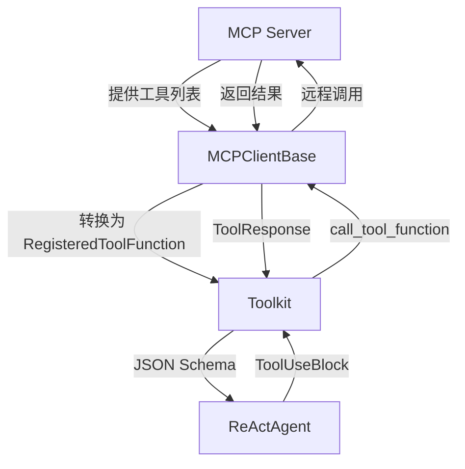
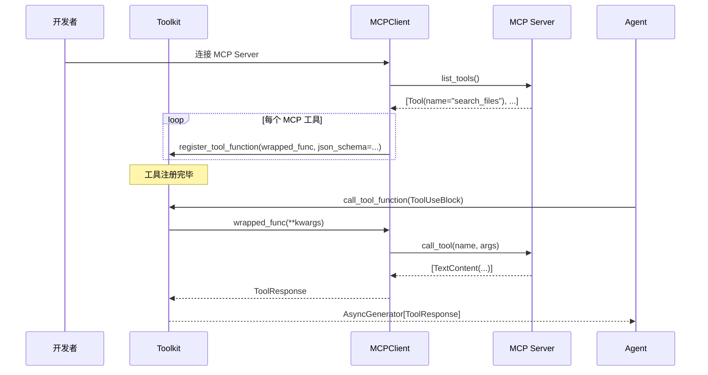

# 第 26 章：集成 MCP Server——对接本地工具服务

> **难度**：中等
>
> 你的 Agent 需要调用本地的一个文件搜索服务。这个服务实现了 MCP（Model Context Protocol）协议——怎么让 AgentScope 的 Toolkit 能调用它？

## 任务目标

理解 MCP 协议，将一个 MCP Server 提供的工具注册到 AgentScope 的 Toolkit 中，让 ReActAgent 可以像调用普通 Python 函数一样调用 MCP 工具。



---

## 知识补全：MCP 协议

MCP（Model Context Protocol）是一个开放协议，让 AI 应用能够连接外部数据源和工具。核心概念：

- **MCP Server**：提供工具（tools）和资源（resources）的服务端
- **MCP Client**：连接 Server、发现工具、调用工具的客户端
- **Transport**：通信方式——stdio（标准输入输出）或 HTTP/SSE

MCP 的工具调用流程：
1. Client 连接 Server
2. Client 获取工具列表（每个工具有 name、description、inputSchema）
3. Client 调用工具（传入 name 和 arguments）
4. Server 返回结果（text、image 等内容块）

---

## AgentScope 的 MCP 模块

打开 `src/agentscope/mcp/` 目录：

```
src/agentscope/mcp/
├── __init__.py
├── _client_base.py              # MCPClientBase 抽象基类
├── _http_stateful_client.py      # HTTP 有状态客户端
├── _http_stateless_client.py     # HTTP 无状态客户端
├── _mcp_function.py             # MCP 工具函数包装
├── _stateful_client_base.py     # 有状态客户端基类
└── _stdio_stateful_client.py     # stdio 传输客户端
```

### MCPClientBase

`MCPClientBase`（`_client_base.py`）是所有 MCP 客户端的基类：

```python
# _client_base.py
class MCPClientBase:
    def __init__(self, name: str) -> None:
        self.name = name

    @abstractmethod
    async def get_callable_function(
        self,
        func_name: str,
        wrap_tool_result: bool = True,
        execution_timeout: float | None = None,
    ) -> Callable: ...

    @staticmethod
    def _convert_mcp_content_to_as_blocks(mcp_content_blocks: list)
        -> List[TextBlock | ImageBlock | AudioBlock | VideoBlock]: ...
```

核心方法：
- `get_callable_function`：获取一个可调用的 Python 函数，它内部封装了对 MCP Server 的远程调用
- `_convert_mcp_content_to_as_blocks`：将 MCP 的内容类型转换为 AgentScope 的 ContentBlock

---

## Step 1：理解 MCP 工具的注册流程

### 1.1 从 MCP Server 获取工具列表

MCP Server 启动后，Client 可以获取它提供的所有工具。每个工具包含：

```json
{
    "name": "search_files",
    "description": "搜索指定目录中的文件",
    "inputSchema": {
        "type": "object",
        "properties": {
            "directory": {"type": "string", "description": "搜索目录"},
            "pattern": {"type": "string", "description": "文件名模式"}
        },
        "required": ["directory"]
    }
}
```

### 1.2 转换为 Toolkit 可用的格式

`_mcp_function.py` 中的代码将 MCP 工具转换为 `RegisteredToolFunction`：

1. 从 `inputSchema` 获取 JSON Schema（不需要从 Python docstring 自动生成）
2. 用 `get_callable_function` 获取包装后的 Python 函数
3. 调用 `toolkit.register_tool_function()` 注册，传入 `json_schema` 参数

### 1.3 注册方式

```python
# 简化的 MCP 工具注册流程
client = StdioStatefulClient(name="filesystem", command="npx", args=["-y", "@modelcontextprotocol/server-filesystem", "/tmp"])

# 获取工具列表
mcp_tools = await client.list_tools()

for tool in mcp_tools:
    # 获取可调用函数
    func = await client.get_callable_function(tool.name)

    # 注册到 Toolkit
    toolkit.register_tool_function(
        func,
        func_name=tool.name,
        func_description=tool.description,
        json_schema=tool.inputSchema,  # 直接使用 MCP 提供的 Schema
        group_name=f"mcp_{client.name}",
    )
```

---

## Step 2：三种 MCP 传输方式

### 2.1 stdio 传输

`StdioStatefulClient`（`_stdio_stateful_client.py`）通过子进程的 stdin/stdout 通信：

```python
# 用法示意（非真实 API）
client = StdioStatefulClient(
    name="filesystem",
    command="npx",
    args=["-y", "@modelcontextprotocol/server-filesystem", "/tmp"],
)
```

适用场景：本地命令行工具，如文件系统访问、Git 操作。

### 2.2 HTTP 传输

`HTTPStatefulClient`（`_http_stateful_client.py`）通过 HTTP POST 通信：

```python
client = HTTPStatefulClient(
    name="web-tools",
    url="http://localhost:8080/mcp",
)
```

`HTTPStatelessClient`（`_http_stateless_client.py`）是无状态版本，每次调用独立。

适用场景：远程服务、需要独立部署的工具服务。

---

## Step 3：完整集成示例

### 3.1 创建一个简单的 MCP Server

用 Python 创建一个最简单的 MCP Server（不需要 API key）：

```python
# simple_mcp_server.py
from mcp.server import Server
from mcp.types import Tool, TextContent

server = Server("demo-tools")

@server.tool("echo")
async def echo(message: str) -> list[TextContent]:
    """回显输入的消息。

    Args:
        message: 要回显的消息
    """
    return [TextContent(type="text", text=f"Echo: {message}")]

@server.tool("add")
async def add(a: int, b: int) -> list[TextContent]:
    """计算两个数的和。

    Args:
        a: 第一个数
        b: 第二个数
    """
    return [TextContent(type="text", text=f"{a} + {b} = {a + b}")]
```

### 3.2 用 stdio 客户端连接

```python
import asyncio
from agentscope.tool import Toolkit

async def integrate_mcp():
    toolkit = Toolkit()

    # 连接 MCP Server（假设已启动）
    # 实际代码：
    # client = StdioStatefulClient(
    #     name="demo",
    #     command="python",
    #     args=["simple_mcp_server.py"],
    # )
    # await client.connect()
    # mcp_tools = await client.list_tools()
    # for tool in mcp_tools:
    #     func = await client.get_callable_function(tool.name)
    #     toolkit.register_tool_function(func, ...)

    # 模拟注册结果（不需要实际 MCP Server）
    def echo(message: str) -> str:
        """回显输入的消息。"""
        return f"Echo: {message}"

    toolkit.register_tool_function(echo)

    # 打印注册的工具
    import json
    for name, func in toolkit.tools.items():
        print(f"工具: {name}")
        print(json.dumps(func.json_schema, ensure_ascii=False, indent=2))

asyncio.run(integrate_mcp())
```

### 3.3 与 ReActAgent 集成

```python
agent = ReActAgent(
    name="mcp_agent",
    sys_prompt="你可以使用 MCP 工具。",
    model=model,
    formatter=formatter,
    toolkit=toolkit,  # 包含 MCP 工具的 Toolkit
    memory=InMemoryMemory(),
)

# MCP 工具和普通 Python 工具对 Agent 来说完全一样
# Agent 不知道也不需要知道工具是本地函数还是远程 MCP 服务
```

---

## Step 4：工具分组管理

MCP 工具可以注册到单独的分组中，方便动态激活/停用：

```python
# 注册时指定分组
toolkit.register_tool_function(
    func,
    group_name="mcp_filesystem",
)

# 默认不激活
toolkit.create_tool_group("mcp_filesystem", description="文件系统 MCP 工具", active=False)
```

这样 MCP 工具默认不会被模型看到。Agent 可以通过 `reset_equipped_tools` meta 工具在运行时决定是否激活 MCP 工具。

---

## 设计一瞥

> **设计一瞥**：MCP 工具 vs 普通 Python 工具——有什么区别？
> 对 Toolkit 来说，两者都是 `RegisteredToolFunction`。区别在于 `source` 字段（`_types.py:18`）：
> - `"function"`：普通 Python 函数
> - `"mcp_server"`：MCP 远程工具
>
> 调用方式也不同：MCP 工具通过 `get_callable_function` 获得的包装函数内部走网络通信（HTTP 或 stdio），而不是直接调用 Python 函数。但 `call_tool_function` 不关心这些——它只看到 `RegisteredToolFunction`，调用 `original_func`，拿到结果包装为 `ToolResponse`。
>
> 这就是抽象层的威力：上层代码不需要知道底层实现。

---

## 完整流程图



---

## 试一试：对比 stdio 和 HTTP 客户端

这个练习不需要 API key（纯源码阅读）。

**目标**：理解两种传输方式的实现差异。

**步骤**：

1. 打开 `src/agentscope/mcp/_stdio_stateful_client.py`，找到它如何启动子进程和通过 stdin/stdout 通信
2. 打开 `src/agentscope/mcp/_http_stateful_client.py`，找到 HTTP 请求的构造方式
3. 回答：为什么 `get_callable_function` 返回的是 `Callable` 而不是直接返回结果？（提示：Toolkit 的 `call_tool_function` 需要一个可调用对象）

4. **进阶**：查看 `_convert_mcp_content_to_as_blocks` 方法，理解 MCP 的内容类型如何映射到 AgentScope 的 ContentBlock：

```bash
grep -n "_convert_mcp_content_to_as_blocks" src/agentscope/mcp/_client_base.py
```

---

## PR 检查清单

提交 MCP 集成的 PR 时：

- [ ] **MCPClientBase 子类**：实现 `get_callable_function` 抽象方法
- [ ] **内容转换**：正确处理 MCP 的 TextContent、ImageContent 等类型
- [ ] **工具分组**：MCP 工具注册到 `mcp_{name}` 分组，方便管理
- [ ] **错误处理**：MCP Server 不可达时的优雅降级
- [ ] **测试**：用 mock MCP Server 测试工具发现和调用
- [ ] **Docstring**：所有公共方法按项目规范
- [ ] **pre-commit 通过**

---

## 检查点

你现在理解了：

- **MCP 协议**：开放标准，让 AI 应用连接外部工具和数据源
- **MCPClientBase**：AgentScope 的 MCP 客户端抽象，核心方法是 `get_callable_function`
- **注册流程**：获取 MCP 工具列表 → 包装为可调用函数 → 注册到 Toolkit
- **传输方式**：stdio（子进程通信）和 HTTP（网络通信）
- **抽象层的价值**：MCP 工具和普通 Python 工具对上层代码完全透明

**自检练习**：

1. MCP 工具的 JSON Schema 从哪里来？和普通 Python 工具有什么区别？（提示：普通工具从 docstring 自动生成，MCP 工具从 `inputSchema` 直接获取）
2. 如果 MCP Server 在调用过程中崩溃了，`call_tool_function` 会怎么处理？（提示：`get_callable_function` 返回的包装函数内部应该有 try/except）

---

## 下一章预告

MCP 工具已经集成好了。下一章，我们进入**高级扩展**——给工具加限流中间件、创建场景分组、注册 Agent Skill，让工具管理更上一层楼。
