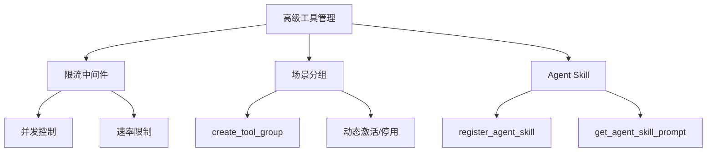
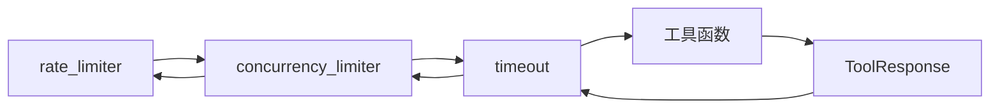
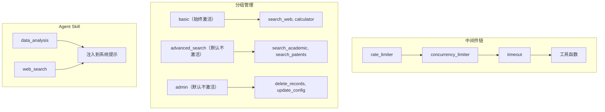

# 第 27 章：高级扩展——限流中间件、场景分组与 Agent Skill

> **难度**：进阶
>
> 你的工具被并发调用时经常超时。你需要加限流、按场景管理工具分组、还能让 Agent 声明自己擅长什么。这些高级能力本章一次性搞定。

## 任务目标

实现三个高级工具管理能力：

1. **限流中间件**：控制工具调用的并发数和频率
2. **场景分组**：按使用场景组织工具，动态激活/停用
3. **Agent Skill**：让 Agent 声明自己的能力，引导模型选择合适的工具



---

## 回顾：中间件和分组

### 中间件的洋葱模型

在第 10 章和第 18 章我们已经学过中间件。`register_middleware`（`_toolkit.py:1441`）注册洋葱式中间件：

```python
async def my_middleware(kwargs, next_handler):
    # 前置处理
    async for response in await next_handler(**kwargs):
        yield response
    # 后置处理
```

`_apply_middlewares`（`_toolkit.py:57`）在运行时动态构建中间件链，最内层是真正的工具函数，外层依次包裹中间件。

### 工具分组

`create_tool_group`（`_toolkit.py:187`）创建分组：

```python
def create_tool_group(
    self,
    group_name: str,
    description: str,
    active: bool = False,
    notes: str | None = None,
) -> None:
```

`ToolGroup`（`_types.py:135`）存储分组信息：

```python
@dataclass
class ToolGroup:
    name: str
    active: bool
    description: str
    notes: str | None
```

### AgentSkill

`AgentSkill`（`_types.py:152`）是一个 TypedDict：

```python
class AgentSkill(TypedDict):
    name: str
    description: str
    dir: str
```

通过 `register_agent_skill(skill_dir)`（`_toolkit.py:1328`）注册，读取 `SKILL.md` 文件中的 YAML front matter。

---

## 扩展一：限流中间件

### 1.1 并发控制

使用 `asyncio.Semaphore` 限制同时执行的工具数量：

```python
import asyncio
from agentscope.tool._response import ToolResponse
from agentscope.message import TextBlock


def create_concurrency_limiter(max_concurrent: int = 5):
    """创建并发限制中间件。

    Args:
        max_concurrent: 最大并发数
    """
    semaphore = asyncio.Semaphore(max_concurrent)

    async def concurrency_middleware(kwargs, next_handler):
        async with semaphore:
            async for response in await next_handler(**kwargs):
                yield response

    return concurrency_middleware
```

使用方式：

```python
toolkit = Toolkit()
toolkit.register_tool_function(query_database)
toolkit.register_middleware(create_concurrency_limiter(max_concurrent=3))
```

当有 10 个工具调用同时发起时，只有 3 个会并行执行，其余排队等待。

### 1.2 速率限制

控制每秒最多调用 N 次：

```python
import time
from collections import deque


def create_rate_limiter(max_calls: int = 10, period: float = 1.0):
    """创建速率限制中间件。

    Args:
        max_calls: 时间窗口内的最大调用次数
        period: 时间窗口（秒）
    """
    call_times = deque()

    async def rate_limit_middleware(kwargs, next_handler):
        now = time.time()

        # 清除过期记录
        while call_times and call_times[0] < now - period:
            call_times.popleft()

        # 检查是否超限
        if len(call_times) >= max_calls:
            wait_time = period - (now - call_times[0])
            if wait_time > 0:
                await asyncio.sleep(wait_time)

        call_times.append(time.time())

        async for response in await next_handler(**kwargs):
            yield response

    return rate_limit_middleware
```

### 1.3 超时控制

限制单个工具调用的最大执行时间：

```python
import asyncio


def create_timeout(timeout_seconds: float = 30.0):
    """创建超时中间件。"""
    async def timeout_middleware(kwargs, next_handler):
        try:
            async for response in asyncio.wait_for(
                next_handler(**kwargs),
                timeout=timeout_seconds,
            ):
                yield response
        except asyncio.TimeoutError:
            yield ToolResponse(
                content=[TextBlock(
                    type="text",
                    text=f"工具调用超时（{timeout_seconds}秒），已取消。",
                )],
                is_last=True,
            )

    return timeout_middleware
```

### 1.4 组合中间件

多个中间件按注册顺序叠加：

```python
toolkit.register_middleware(create_rate_limiter(max_calls=20, period=1.0))
toolkit.register_middleware(create_concurrency_limiter(max_concurrent=5))
toolkit.register_middleware(create_timeout(timeout_seconds=30.0))
```

执行顺序：rate_limit → concurrency → timeout → 真正的工具函数。



---

## 扩展二：场景分组

### 2.1 创建场景分组

```python
toolkit = Toolkit()

# 基础工具（始终激活）
toolkit.register_tool_function(search_web)
toolkit.register_tool_function(calculator)

# 高级工具（默认不激活）
toolkit.create_tool_group(
    group_name="advanced_search",
    description="高级搜索工具：学术搜索、专利搜索等",
    active=False,
)
toolkit.register_tool_function(search_academic, group_name="advanced_search")
toolkit.register_tool_function(search_patents, group_name="advanced_search")

# 管理工具（默认不激活）
toolkit.create_tool_group(
    group_name="admin",
    description="管理操作：删除数据、修改配置等",
    active=False,
)
toolkit.register_tool_function(delete_records, group_name="admin")
toolkit.register_tool_function(update_config, group_name="admin")
```

### 2.2 查看分组状态

```python
for name, group in toolkit.groups.items():
    status = "激活" if group.active else "未激活"
    print(f"分组 '{name}': {status} - {group.description}")
```

### 2.3 动态激活

Agent 可以通过 `reset_equipped_tools` 这个 meta 工具在运行时激活/停用分组：

```python
# 在 ReActAgent 的循环中，模型可以决定激活 "advanced_search" 分组
# 这通过调用 reset_equipped_tools 工具实现
```

`call_tool_function`（`_toolkit.py:853`）在执行前会检查工具分组是否激活：

```python
# _toolkit.py:880（简化）
if tool_func.group != "basic" and not self.groups[tool_func.group].active:
    return ToolResponse(content=[TextBlock(text="FunctionInactiveError: ...")])
```

---

## 扩展三：Agent Skill

### 3.1 什么是 Agent Skill

AgentSkill（`_types.py:152`）描述 Agent 的能力。它不直接提供工具，而是告诉模型"这个 Agent 擅长什么"。

```python
class AgentSkill(TypedDict):
    name: str         # 技能名称
    description: str  # 技能描述
    dir: str          # 技能目录
```

### 3.2 注册 Skill

通过 `register_agent_skill`（`_toolkit.py:1328`）注册。它读取一个目录中的 `SKILL.md` 文件：

```markdown
---
name: data_analysis
description: 分析 CSV 和 Excel 数据，生成统计报告
---

# 数据分析技能

这个 Agent 擅长：
- 读取 CSV/Excel 文件
- 计算统计指标
- 生成数据报告
```

```python
toolkit.register_agent_skill("/path/to/skill_dir")
```

### 3.3 Skill 如何影响 Agent 行为

`get_agent_skill_prompt`（`_toolkit.py:1411`）把所有注册的 Skill 整理成文本，注入到系统提示中：

```python
skill_prompt = toolkit.get_agent_skill_prompt()
# 返回类似：
# "你拥有以下技能：
# 1. data_analysis: 分析 CSV 和 Excel 数据，生成统计报告
# 2. web_search: 搜索互联网获取最新信息
# ..."
```

模型看到这些技能描述后，能更好地决定调用哪些工具。

---

## 设计一瞥

> **设计一瞥**：为什么 Skill 是声明式的而不是代码？
> `AgentSkill` 只有 `name`、`description`、`dir` 三个字段——没有可执行代码。它是给模型看的"能力标签"，不是实际的执行逻辑。
> 这和 MCP 工具形成对比：MCP 工具是"隐式"的（模型不需要知道它是远程调用），而 Skill 是"显式"的（专门告诉模型你擅长什么）。
> 原因：Skill 的目的不是执行，而是**引导模型的行为选择**。模型看到"你擅长数据分析"会更倾向于调用数据分析相关的工具。

---

## 完整流程图



---

## 试一试：构建一个带监控的中间件

这个练习不需要 API key。

**目标**：创建一个中间件，记录每个工具调用的耗时和成功率。

**步骤**：

1. 定义监控中间件：

```python
import time
from collections import defaultdict

stats = defaultdict(lambda: {"calls": 0, "errors": 0, "total_time": 0.0})

async def monitoring_middleware(kwargs, next_handler):
    tool_name = kwargs.get("tool_call", {}).get("name", "unknown")
    start = time.time()
    stats[tool_name]["calls"] += 1

    try:
        async for response in await next_handler(**kwargs):
            yield response
    except Exception as e:
        stats[tool_name]["errors"] += 1
        raise
    finally:
        stats[tool_name]["total_time"] += time.time() - start


def print_stats():
    for name, s in stats.items():
        avg = s["total_time"] / s["calls"] if s["calls"] > 0 else 0
        print(f"  {name}: {s['calls']} 次调用, {s['errors']} 次错误, 平均 {avg:.2f}s")
```

2. 注册并测试：

```python
toolkit.register_middleware(monitoring_middleware)
# ... 运行几次工具调用 ...
print("=== 工具调用统计 ===")
print_stats()
```

3. **进阶**：把 `stats` 存到文件中，实现跨会话的调用统计。

---

## PR 检查清单

提交高级扩展的 PR 时：

- [ ] **中间件签名正确**：`async def (kwargs, next_handler) -> AsyncGenerator[ToolResponse, None]`
- [ ] **分组命名**：使用有意义的分组名，不是 `"basic"`
- [ ] **Skill 文件**：`SKILL.md` 包含 YAML front matter（name + description）
- [ ] **错误处理**：中间件中的异常不会吞掉原始错误
- [ ] **测试**：验证中间件的执行顺序、分组激活/停用、Skill 注册
- [ ] **pre-commit 通过**

---

## 检查点

你现在理解了：

- **限流中间件**：用 Semaphore 控制并发，用 deque + sleep 控制速率，用 wait_for 控制超时
- **中间件组合**：多个中间件按注册顺序叠加，形成洋葱链
- **场景分组**：`create_tool_group` + `register_tool_function(group_name=...)` 实现动态工具管理
- **Agent Skill**：声明式的能力标签，通过 `get_agent_skill_prompt` 注入系统提示
- **Skill vs 工具**：Skill 是引导模型行为的标签，工具是实际执行的函数

**自检练习**：

1. 如果把 `create_rate_limiter` 和 `create_concurrency_limiter` 的注册顺序反过来，行为会有什么变化？（提示：中间件从外到内执行）
2. `"basic"` 分组能被 `create_tool_group` 创建吗？（提示：看 `_toolkit.py:187` 的参数验证）

---

## 下一章预告

我们已经造了 Tool、Model、Memory、Agent、MCP 集成、高级中间件——6 个独立的齿轮。下一章是卷三的终章，我们把它们**组装起来**，跑通端到端测试。
