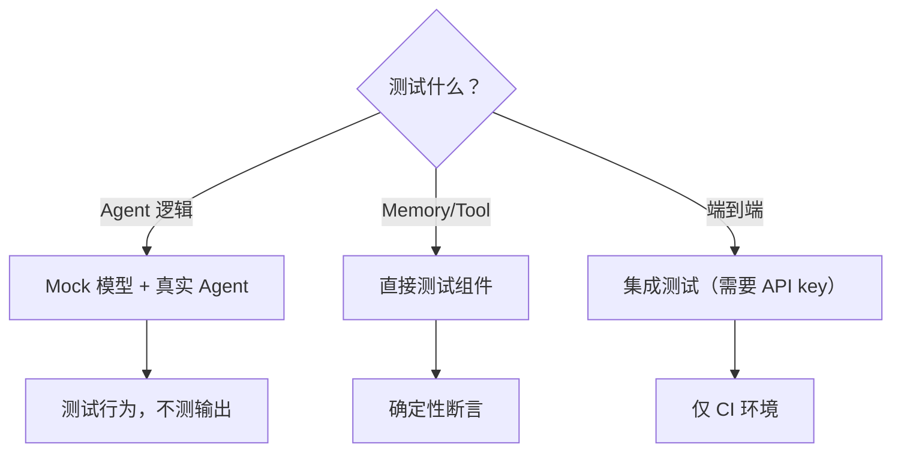

# 第 27 章：测试模式——Agent 代码的验证策略

> **难度**：中等
>
> Agent 调用了大模型，模型输出不确定。怎么测试？这一章我们看 AgentScope 的测试策略和你的自定义模块应该怎么写测试。

## 挑战：不确定的模型输出

传统测试依赖确定性断言：

```python
assert add(2, 3) == 5  # 永远是对的
```

但 Agent 测试面对的是不确定输出：

```python
response = await agent(msg)
assert response.content == "..."  # 每次都不一样！
```

三种应对策略：

---

## 策略一：Mock 模型

最常用的策略——用固定的假模型替代真实 API：

```python
"""Mock 模型用于测试"""
from unittest.mock import AsyncMock
from agentscope.message import Msg, TextBlock
from agentscope.model import ChatResponse, ChatUsage


def create_mock_model(response_text: str = "测试回复"):
    """创建一个返回固定文本的 Mock 模型"""
    mock_model = AsyncMock()
    mock_model.return_value = ChatResponse(
        content=[TextBlock(type="text", text=response_text)],
        usage=ChatUsage(prompt_tokens=10, completion_tokens=5),
    )
    return mock_model
```

使用 Mock 测试 Agent：

```python
import asyncio
from agentscope.agent import AgentBase
from agentscope.message import Msg


class SimpleAgent(AgentBase):
    def __init__(self, name, model):
        super().__init__(name=name)
        self.model = model

    async def reply(self, msg=None):
        response = await self.model([msg])
        return Msg(name=self.name, content=response.content[0].text, role="assistant")


async def test_simple_agent():
    mock_model = create_mock_model("你好！")
    agent = SimpleAgent(name="test", model=mock_model)

    response = await agent.reply(Msg("user", "Hello", "user"))
    assert "你好" in response.content
    mock_model.assert_called_once()  # 验证模型被调用了


asyncio.run(test_simple_agent())
```

关键点：Mock 让测试**不依赖 API key**，**不消耗 token**，**执行速度快**。

---

## 策略二：测试行为，不测试输出

不检查"Agent 说了什么"，检查"Agent 做了什么"：

```python
async def test_tool_called():
    """测试工具被正确调用"""
    mock_model = create_mock_model_with_tool_call("get_weather", {"city": "北京"})
    toolkit = create_toolkit_with_mock_tool()
    agent = ReActAgent(name="test", model=mock_model, toolkit=toolkit, ...)

    await agent.reply(Msg("user", "北京天气怎么样", "user"))

    # 不检查回复内容，只检查工具是否被调用
    assert toolkit.tools["get_weather"].original_func.called
```

### 行为测试的关注点

| 测试什么 | 不测试什么 |
|----------|-----------|
| 工具是否被调用 | 模型的具体回复文本 |
| 记忆是否被更新 | 模型的 token 数量 |
| Hook 是否触发 | 中间件的执行时间 |
| 序列化/反序列化 | 模型调用次数（可能变化） |
| 异常是否被处理 | |

---

## 策略三：测试框架组件

AgentScope 的测试套件（`tests/` 目录）大量使用这个策略——测试单个组件，不测端到端流程：

### 测试 Memory

打开 `tests/memory_test.py`：

```python
# memory_test.py:17-49
class ShortTermMemoryTest(IsolatedAsyncioTestCase):
    async def asyncSetUp(self):
        self.msgs = [Msg("user", str(i), "user") for i in range(10)]
        for i, msg in enumerate(self.msgs):
            msg.id = str(i)

    async def _basic_tests(self):
        # 测试初始状态
        self.assertEqual(await self.memory.size(), 0)

        # 测试添加
        await self.memory.add(self.msgs[:5])
        self.assertEqual(await self.memory.size(), 5)

        # 测试删除
        await self.memory.delete(msg_ids=["2", "4"])
        self.assertEqual(await self.memory.size(), 3)
```

### 测试自定义 Memory

为第 22 章的 `FileMemory` 写测试：

```python
"""FileMemory 测试"""
import asyncio
import os
from agentscope.message import Msg
from my_memory import FileMemory


async def test_file_memory():
    path = "test_memory.json"
    try:
        memory = FileMemory(path)

        # 测试添加
        await memory.add(Msg("user", "Hello", "user"))
        await memory.add(Msg("assistant", "Hi!", "assistant"))
        assert await memory.size() == 2

        # 测试获取
        msgs = await memory.get_memory()
        assert len(msgs) == 2

        # 测试持久化
        memory2 = FileMemory(path)
        assert await memory2.size() == 2

        # 测试删除
        ids = [msgs[0].id]
        deleted = await memory2.delete(ids)
        assert deleted == 1
        assert await memory2.size() == 1

        # 测试清空
        await memory2.clear()
        assert await memory2.size() == 0

    finally:
        if os.path.exists(path):
            os.remove(path)


asyncio.run(test_file_memory())
```

---

## 测试文件的组织

```
tests/
├── memory_test.py           # Memory 测试
├── formatter_openai_test.py # Formatter 测试
├── hook_test.py             # Hook 测试
├── model_openai_test.py     # Model 测试
├── config_test.py           # 配置测试
└── ...
```

命名规则：`模块名_test.py`。每个测试类继承 `IsolatedAsyncioTestCase`（因为 AgentScope 是全异步的）。



AgentScope 的测试策略体现在 GitHub 仓库的 `tests/` 目录中。官方文档虽然没有专门的测试章节，但 Building Blocks > Observability 中的追踪功能可以在集成测试中辅助调试 Agent 行为。

AgentScope 仓库的 `tests/` 目录是最好的测试模式参考，其中展示了以下关键模式：
- 使用 `IsolatedAsyncioTestCase` 作为测试基类（框架全异步）
- 用 `AsyncMock` 替代真实模型，避免 API 依赖和 token 消耗
- 测试文件按 `模块名_test.py` 命名（如 `memory_test.py`、`formatter_openai_test.py`）
- 重点关注行为断言（工具是否被调用、记忆是否更新），而非输出文本断言

---

## 试一试：为一个工具写测试

**目标**：为第 21 章的计算器工具写单元测试。

**步骤**：

1. 创建 `test_calculator.py`：

```python
import asyncio
from agentscope.tool import Toolkit, ToolResponse
from agentscope.message import TextBlock


def calculate(expression: str, precision: int = 2) -> ToolResponse:
    """计算数学表达式"""
    try:
        result = eval(expression)
        return ToolResponse(content=[TextBlock(type="text", text=str(round(result, precision)))])
    except Exception as e:
        return ToolResponse(content=[TextBlock(type="text", text=f"错误: {e}")])


async def test_calculate():
    toolkit = Toolkit()
    toolkit.register_tool_function(calculate)

    # 测试 Schema 生成
    assert "calculate" in toolkit.tools
    schema = toolkit.tools["calculate"].json_schema
    assert schema["function"]["name"] == "calculate"
    params = schema["function"]["parameters"]["properties"]
    assert "expression" in params
    assert "precision" in params

    # 测试工具执行
    tool_call = {"name": "calculate", "input": '{"expression": "2 + 3", "precision": 0}'}
    result = []
    async for r in await toolkit.call_tool_function(tool_call):
        result.append(r)
    assert result[0].content[0]["text"] == "5"

    # 测试错误处理
    tool_call_err = {"name": "calculate", "input": '{"expression": "1/0"}'}
    result_err = []
    async for r in await toolkit.call_tool_function(tool_call_err):
        result_err.append(r)
    assert "错误" in result_err[0].content[0]["text"]

    print("所有测试通过！")


asyncio.run(test_calculate())
```

2. 运行并观察结果。

---

## 检查点

- **Mock 模型**：用 `AsyncMock` 替代真实模型，测试不依赖 API
- **测行为不测输出**：检查工具是否被调用、记忆是否更新，不检查文本内容
- **组件测试**：单独测试 Memory、Tool、Formatter，确定性断言
- AgentScope 测试使用 `IsolatedAsyncioTestCase`
- 测试文件命名：`模块名_test.py`

---

## 下一章预告

测试通过不代表没有问题。当你遇到运行时 bug，怎么高效调试？下一章我们看调试指南。
