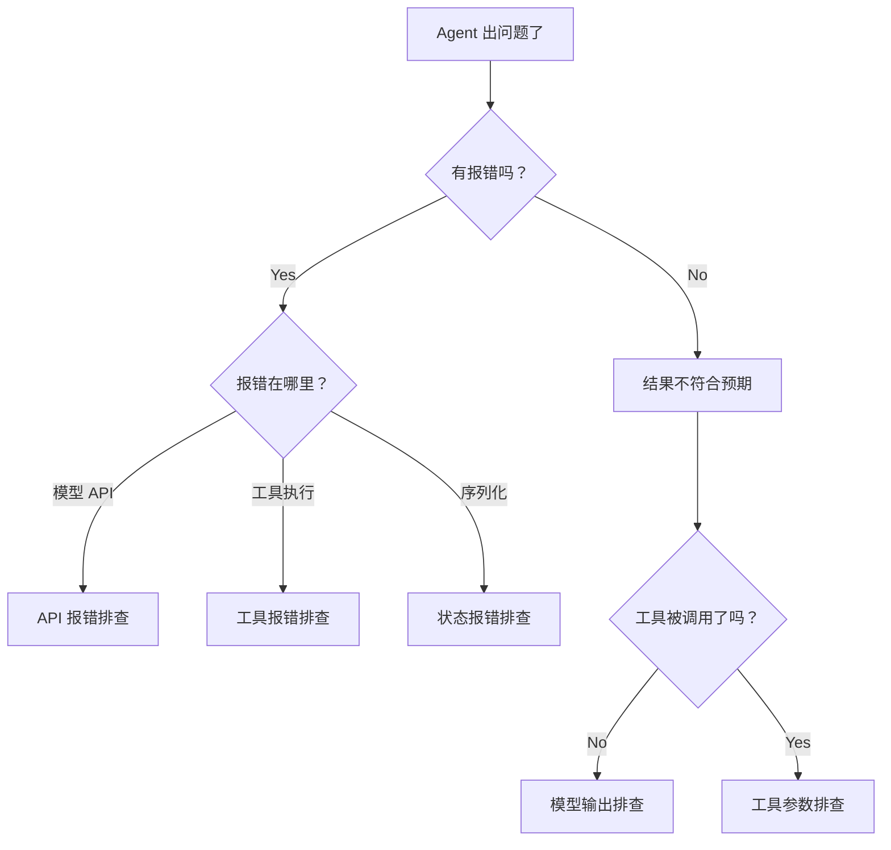

# 第 28 章：调试指南——Agent 出了问题怎么排查

> **难度**：入门
>
> Agent 返回了错误的结果、工具调用失败、模型超时……怎么快速定位问题？这一章是一份实用的排查清单。

## 常见问题分类



---

## 场景一：模型 API 报错

### 症状

```
openai.APIError: Error code 401 - Invalid API key
```

### 排查步骤

1. **检查 API key**：确认环境变量是否设置

```bash
echo $OPENAI_API_KEY
```

2. **检查模型配置**：确认 model_name 和 API 地址正确

```python
print(model.model_name)    # 应该是 "gpt-4o" 等
print(model.client.base_url)  # 检查 API 地址
```

3. **检查网络**：如果是 Ollama 等本地服务

```bash
curl http://localhost:11434/api/tags
```

### 常见错误码

| 错误码 | 原因 | 解决方案 |
|--------|------|----------|
| 401 | API key 无效 | 检查环境变量 |
| 429 | 请求频率过高 | 加重试或降频 |
| 500 | 服务端错误 | 重试或换模型 |
| 超时 | 网络问题 | 检查代理/超时设置 |

---

## 场景二：工具调用失败

### 症状

Agent 应该调用工具但没有调用，或者调用了但参数错误。

### 排查步骤

1. **检查工具是否注册成功**

```python
toolkit = Toolkit()
toolkit.register_tool_function(my_tool)
print(f"已注册工具: {list(toolkit.tools.keys())}")
```

2. **检查 JSON Schema**

```python
import json
for name, func in toolkit.tools.items():
    print(json.dumps(func.json_schema, ensure_ascii=False, indent=2))
```

常见问题：
- 参数缺少类型标注 → Schema 中没有 properties
- docstring 格式不对 → description 为空
- 参数名与 Schema 冲突

3. **检查模型是否收到工具 Schema**

```python
schemas = toolkit.get_json_schemas()
print(f"传给模型的工具数: {len(schemas)}")
```

4. **检查工具函数本身**

```python
# 直接调用工具函数测试
result = my_tool(param1="test")
print(result.content)
```

---

## 场景三：记忆丢失

### 症状

Agent 似乎"忘记"了之前的对话。

### 排查步骤

1. **检查记忆内容**

```python
msgs = await agent.memory.get_memory()
print(f"记忆中有 {len(msgs)} 条消息")
for msg in msgs:
    print(f"  {msg.name}: {msg.content[:50] if isinstance(msg.content, str) else '[复杂内容]'}")
```

2. **检查序列化是否完整**

```python
state = agent.state_dict()
print(f"state_dict 键: {list(state.keys())}")
print(f"memory 在 state 中: {'memory' in state}")
```

3. **检查 `_module_dict`**

```python
print(f"被追踪的子模块: {list(agent._module_dict.keys())}")
# 应该包含 memory, toolkit 等
```

如果 memory 不在 `_module_dict` 中，说明 `InMemoryMemory` 没有正确继承 `StateModule`。

---

## 场景四：Hook 不生效

### 症状

注册了 Hook 但没有执行。

### 排查步骤

1. **检查元类**：Hook 依赖元类自动包装。确认你的 Agent 类的元类是 `_AgentMeta` 或 `_ReActAgentMeta`：

```python
print(type(agent.__class__))  # 应该是 _AgentMeta 或 _ReActAgentMeta
```

2. **检查 Hook 类型**：确认 Hook 名称在 `supported_hook_types` 中：

```python
print(agent.supported_hook_types)
# AgentBase: pre_reply, post_reply, pre_print, ...
# ReActAgentBase: + pre_reasoning, post_reasoning, pre_acting, post_acting
```

3. **检查注册方式**：实例级和类级别的注册是分开的

```python
print(f"实例级 pre_reply hooks: {list(agent._instance_pre_reply_hooks.keys())}")
```

---

## 调试工具箱

### 1. 加 print 大法

在关键位置加 print 仍然是最有效的调试方法：

```python
# 在 _react_agent.py 的 reply 方法中
async def reply(self, msg=None):
    print(f"[DEBUG] reply 开始，记忆: {await self.memory.size()} 条")
    ...
    print(f"[DEBUG] reasoning 结果: {reasoning_result}")
    ...
    print(f"[DEBUG] reply 结束")
```

**恢复**：

```bash
git checkout src/agentscope/
```

### 2. 使用 Hook 记录

不改源码，用 Hook 记录 Agent 行为：

```python
def debug_hook(self, kwargs, output):
    print(f"[HOOK] {self.name} reply")
    print(f"  输入: {kwargs}")
    print(f"  输出: {output.content[:100] if isinstance(output.content, str) else '...'}")
    return output

agent.register_instance_post_reply_hook("debug", debug_hook)
```

### 3. 使用中间件记录工具调用

```python
async def debug_middleware(kwargs, next_handler):
    tool_call = kwargs["tool_call"]
    print(f"[MW] 调用工具: {tool_call['name']}")
    print(f"[MW] 参数: {tool_call.get('input', {})}")

    async for response in await next_handler(**kwargs):
        text = response.content[0]["text"] if response.content else ""
        print(f"[MW] 结果: {text[:100]}")
        yield response

toolkit.register_middleware(debug_middleware)
```

### 4. 使用追踪

启用 OpenTelemetry 追踪后，在 Jaeger/Zipkin 中查看完整的调用链：

```python
import agentscope
agentscope.setup_tracing(endpoint="http://localhost:4318/v1/traces")
```

> **官方文档对照**：本文对应 [Building Blocks > Observability](https://docs.agentscope.io/building-blocks/observability) 和 [Building Blocks > Hooking Functions](https://docs.agentscope.io/building-blocks/hooking-functions)。官方文档展示了追踪和 Hook 的使用方法，本章提供了具体的排查流程和调试技巧。
>
> **推荐阅读**：[AgentScope GitHub Issues](https://github.com/modelscope/agentscope/issues) 中有大量实际问题的排查记录。

---

## 试一试：调试一个序列化问题

**目标**：模拟"记忆丢失"并排查。

**步骤**：

1. 创建测试脚本，故意制造问题：

```python
import asyncio
from agentscope.agent import AgentBase
from agentscope.memory import InMemoryMemory
from agentscope.message import Msg


class BrokenAgent(AgentBase):
    """一个有 bug 的 Agent：memory 不会被自动追踪"""

    def __init__(self, name):
        super().__init__(name=name)
        # 这个 memory 会被自动追踪（因为 InMemoryMemory 继承 StateModule）
        self.memory = InMemoryMemory()

        # 这个普通 dict 不会被追踪
        self.extra_data = {"key": "value"}

    async def reply(self, msg=None):
        if msg:
            await self.memory.add(msg)
        return Msg(name=self.name, content="OK", role="assistant")


async def main():
    agent = BrokenAgent(name="test")
    await agent.reply(Msg("user", "Hello", "user"))

    state = agent.state_dict()
    print(f"state_dict 键: {list(state.keys())}")
    print(f"memory 被追踪: {'memory' in state}")
    print(f"extra_data 被追踪: {'extra_data' in state}")

    # 如果要追踪 extra_data，需要手动注册
    agent.register_state("extra_data")
    state2 = agent.state_dict()
    print(f"注册后 extra_data 被追踪: {'extra_data' in state2}")


asyncio.run(main())
```

2. 观察：`memory` 被自动追踪，`extra_data` 不被追踪。需要 `register_state` 手动注册。

---

## 检查点

- **模型报错**：检查 API key、模型名、网络连接
- **工具失败**：检查注册状态、JSON Schema、函数参数
- **记忆丢失**：检查 `state_dict()` 和 `_module_dict`
- **Hook 不生效**：检查元类和 Hook 类型名称
- 调试工具：print、Hook、中间件、OpenTelemetry 追踪

---

## 第三卷总结

第三卷我们从**读者**变成了**作者**——动手构建了：

| 章 | 构建内容 | 核心抽象 |
|----|----------|----------|
| 21 | 自定义工具函数 | `ToolResponse`, `register_tool_function` |
| 22 | 自定义 Memory | `MemoryBase` 的 5 个抽象方法 |
| 23 | 自定义 Formatter | `FormatterBase.format()` |
| 24 | 自定义中间件 | 洋葱模型的 async generator |
| 25 | 自定义 Agent | `AgentBase.reply()` |
| 26 | Pipeline 编排 | Sequential, Fanout, MsgHub |
| 27 | 测试模式 | Mock 模型 + 行为测试 |
| 28 | 调试指南 | 排查清单 + 调试工具箱 |

你现在已经能：
- 为框架添加新的工具、Memory、Formatter
- 编写中间件增强工具执行
- 构建自定义 Agent 和 Pipeline
- 测试和调试你的扩展

---

## 第四卷预告

第三卷我们学会了**构建**。第四卷我们要理解**为什么这样构建**——深入设计权衡，看那些"如果当初选了另一条路会怎样"的决策。
