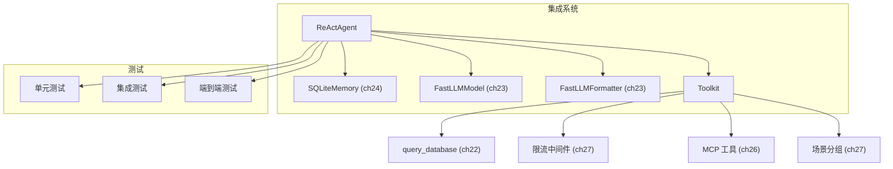
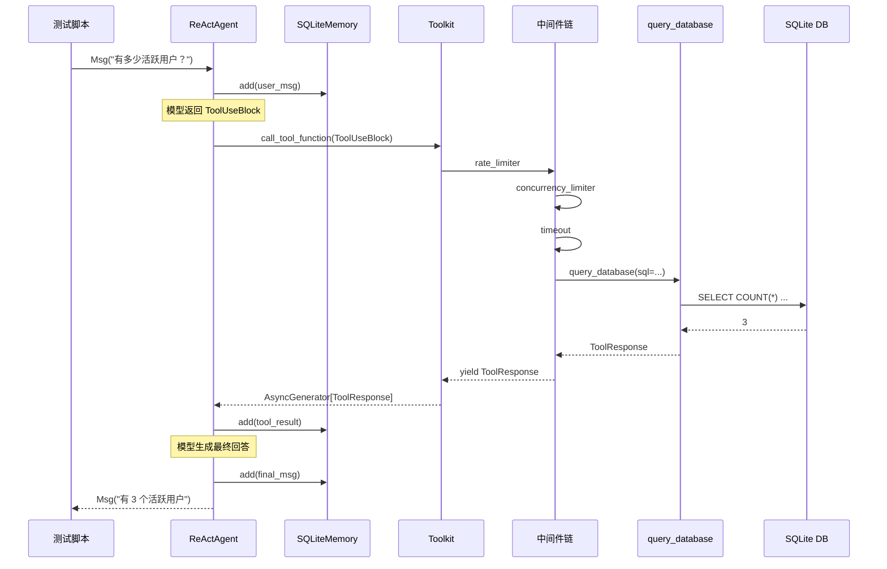

# 第 28 章：终章——集成实战

> **难度**：进阶
>
> 我们在 ch22-ch27 分别造了 Tool、Model、Memory、Agent、MCP 集成和高级中间件。现在把它们组装成一个完整的系统，跑通端到端测试。

## 任务目标

把前面 6 章构建的组件集成为一个完整的多功能 Agent 系统：



---

## Step 1：组装组件

### 1.1 导入所有自建模块

```python
import agentscope
from agentscope.agent import ReActAgent
from agentscope.memory import InMemoryMemory
from agentscope.formatter import OpenAIChatFormatter
from agentscope.tool import Toolkit
from agentscope.message import Msg, ToolUseBlock

# ch22: 自定义工具
from my_tools import query_database, query_database_stream

# ch23: 自定义 Model 和 Formatter
from my_model import FastLLMModel
from my_formatter import FastLLMFormatter

# ch24: 自定义 Memory
from my_memory import SQLiteMemory

# ch27: 中间件
from my_middlewares import (
    create_concurrency_limiter,
    create_rate_limiter,
    create_timeout,
    monitoring_middleware,
)
```

### 1.2 组装 Toolkit

```python
toolkit = Toolkit()

# 注册普通工具
toolkit.register_tool_function(query_database)
toolkit.register_tool_function(query_database_stream)

# 创建场景分组
toolkit.create_tool_group(
    group_name="database",
    description="数据库查询工具",
    active=True,
)
toolkit.register_tool_function(
    query_database,
    group_name="database",
    preset_kwargs={"db_path": "production.db"},
)

# 注册中间件
toolkit.register_middleware(create_rate_limiter(max_calls=20, period=1.0))
toolkit.register_middleware(create_concurrency_limiter(max_concurrent=5))
toolkit.register_middleware(create_timeout(timeout_seconds=30.0))
toolkit.register_middleware(monitoring_middleware)
```

### 1.3 组装 Agent

```python
agentscope.init(project="integration-demo")

# 方案 A：使用 OpenAI（需要 API key）
from agentscope.model import OpenAIChatModel
agent = ReActAgent(
    name="data_assistant",
    sys_prompt="你是一个数据助手。用 query_database 工具回答数据问题。",
    model=OpenAIChatModel(model_name="gpt-4o"),
    formatter=OpenAIChatFormatter(),
    toolkit=toolkit,
    memory=SQLiteMemory(db_path="agent_memory.db"),
)

# 方案 B：使用 FastLLM（mock，不需要 API key）
agent_mock = ReActAgent(
    name="data_assistant_mock",
    sys_prompt="你是一个数据助手。",
    model=FastLLMModel(model_name="fastllm-v1"),
    formatter=FastLLMFormatter(),
    toolkit=toolkit,
    memory=SQLiteMemory(db_path="agent_memory_mock.db"),
)
```

---

## Step 2：单元测试

### 2.1 测试工具

```python
import asyncio
import pytest
import os


@pytest.fixture
def toolkit_with_tools():
    tk = Toolkit()
    tk.register_tool_function(query_database)
    return tk


async def test_query_database_basic(toolkit_with_tools):
    """测试数据库查询工具的基本功能。"""
    setup_demo_db("test.db")
    tk = toolkit_with_tools

    tool_call = ToolUseBlock(
        type="tool_use",
        id="test_1",
        name="query_database",
        input={"sql": "SELECT COUNT(*) as cnt FROM users", "db_path": "test.db"},
    )

    results = []
    async for response in tk.call_tool_function(tool_call):
        results.append(response)

    assert len(results) > 0
    assert "cnt" in results[-1].content[0]["text"].lower() or "1" in results[-1].content[0]["text"]

    os.remove("test.db")


async def test_query_database_rejects_non_select(toolkit_with_tools):
    """测试非 SELECT 查询被拒绝。"""
    tk = toolkit_with_tools

    tool_call = ToolUseBlock(
        type="tool_use",
        id="test_2",
        name="query_database",
        input={"sql": "DROP TABLE users", "db_path": "test.db"},
    )

    async for response in tk.call_tool_function(tool_call):
        assert "错误" in response.content[0]["text"] or "仅支持" in response.content[0]["text"]
```

### 2.2 测试 Memory

```python
async def test_sqlite_memory_basic():
    """测试 SQLiteMemory 的基本功能。"""
    db_path = "test_unit_memory.db"
    mem = SQLiteMemory(db_path=db_path)

    await mem.add(Msg("user", "你好", "user"))
    await mem.add(Msg("assistant", "你好！", "assistant"), marks=["GREETING"])

    all_msgs = await mem.get_memory()
    assert len(all_msgs) == 2

    greeted = await mem.get_memory(mark="GREETING")
    assert len(greeted) == 1

    assert await mem.size() == 2

    await mem.clear()
    assert await mem.size() == 0

    os.remove(db_path)


async def test_sqlite_memory_serialization():
    """测试 SQLiteMemory 的序列化/反序列化。"""
    db_path = "test_ser_memory.db"
    mem = SQLiteMemory(db_path=db_path)

    await mem.add(Msg("user", "测试消息", "user"))

    state = mem.state_dict()
    assert "db_path" in state
    assert state["db_path"] == db_path

    # 恢复
    mem2 = SQLiteMemory(db_path="temp.db")
    mem2.load_state_dict(state)
    assert mem2.db_path == db_path

    result = await mem2.get_memory()
    assert len(result) == 1

    os.remove(db_path)
```

### 2.3 测试 Model（Mock）

```python
async def test_fastllm_model_non_stream():
    """测试 FastLLMModel 非流式调用。"""
    model = FastLLMModel(model_name="fastllm-v1", stream=False)

    messages = [{"role": "user", "content": "测试"}]
    response = await model(messages)

    assert response.content is not None
    assert response.usage is not None
    assert response.usage.input_tokens > 0


async def test_fastllm_model_stream():
    """测试 FastLLMModel 流式调用。"""
    model = FastLLMModel(model_name="fastllm-v1", stream=True)

    messages = [{"role": "user", "content": "测试"}]
    chunks = []
    async for chunk in model(messages):
        chunks.append(chunk)

    assert len(chunks) > 0
    assert chunks[-1].usage is not None
```

---

## Step 3：集成测试

### 3.1 Toolkit + Memory 集成

```python
async def test_toolkit_memory_integration():
    """测试工具调用结果存入 Memory。"""
    setup_demo_db("test.db")
    mem = SQLiteMemory(db_path="test_int.db")
    tk = Toolkit()
    tk.register_tool_function(query_database)

    # 模拟 Agent 调用工具
    tool_call = ToolUseBlock(
        type="tool_use",
        id="int_1",
        name="query_database",
        input={"sql": "SELECT COUNT(*) FROM users WHERE status='active'", "db_path": "test.db"},
    )

    # 存入用户消息
    await mem.add(Msg("user", "有多少活跃用户？", "user"))

    # 调用工具
    result_text = ""
    async for response in tk.call_tool_function(tool_call):
        result_text = response.content[0]["text"]

    # 存入工具结果
    await mem.add(Msg("system", result_text, "system"))

    # 验证
    msgs = await mem.get_memory()
    assert len(msgs) == 2  # 用户消息 + 工具结果
    assert "活跃" in msgs[0].content or "active" in msgs[0].content

    os.remove("test.db")
    os.remove("test_int.db")
```

### 3.2 中间件 + Toolkit 集成

```python
async def test_middleware_chain():
    """测试中间件链的正确执行。"""
    tk = Toolkit()
    call_log = []

    async def logging_middleware(kwargs, next_handler):
        tool_name = kwargs.get("tool_call", {}).get("name", "")
        call_log.append(f"before:{tool_name}")
        async for response in await next_handler(**kwargs):
            call_log.append(f"after:{tool_name}")
            yield response

    tk.register_tool_function(query_database)
    tk.register_middleware(logging_middleware)

    setup_demo_db("test.db")
    tool_call = ToolUseBlock(
        type="tool_use", id="mw_1", name="query_database",
        input={"sql": "SELECT 1", "db_path": "test.db"},
    )

    async for _ in tk.call_tool_function(tool_call):
        pass

    assert "before:query_database" in call_log
    assert "after:query_database" in call_log

    os.remove("test.db")
```

---

## Step 4：端到端测试

### 4.1 不用 API key 的端到端测试

直接跳过模型层，模拟完整的 Agent 循环：

```python
async def test_end_to_end_no_api():
    """端到端测试：模拟完整的 ReAct 循环。"""
    setup_demo_db("test.db")

    # 1. 初始化组件
    memory = SQLiteMemory(db_path="test_e2e.db")
    toolkit = Toolkit()
    toolkit.register_tool_function(query_database)

    # 2. 用户消息
    user_msg = Msg("user", "有多少活跃用户？", "user")
    await memory.add(user_msg)

    # 3. 模拟模型返回 ToolUseBlock（跳过真实模型调用）
    tool_call = ToolUseBlock(
        type="tool_use",
        id="e2e_1",
        name="query_database",
        input={"sql": "SELECT COUNT(*) as cnt FROM users WHERE status='active'", "db_path": "test.db"},
    )
    model_msg = Msg("assistant", [tool_call], "assistant")
    await memory.add(model_msg)

    # 4. 执行工具
    tool_result = ""
    async for response in toolkit.call_tool_function(tool_call):
        tool_result = response.content[0]["text"]

    # 5. 存入工具结果
    from agentscope.message import ToolResultBlock
    await memory.add(Msg("system", [ToolResultBlock(
        type="tool_result",
        tool_use_id="e2e_1",
        output=tool_result,
    )], "system"))

    # 6. 模拟模型总结
    final_msg = Msg("assistant", f"根据查询结果，{tool_result}", "assistant")
    await memory.add(final_msg)

    # 7. 验证完整链路
    all_msgs = await memory.get_memory()
    assert len(all_msgs) == 4  # 用户 + 模型 + 工具结果 + 最终回答
    assert "活跃" in all_msgs[-1].content or "cnt" in all_msgs[-1].content

    # 8. 验证持久化
    state = memory.state_dict()
    assert state["db_path"] == "test_e2e.db"

    # 清理
    for f in ["test.db", "test_e2e.db"]:
        if os.path.exists(f):
            os.remove(f)
```

### 4.2 完整的 ReAct 循环（需要 API key）

```python
async def test_full_react_loop():
    """完整 ReAct 循环测试（需要 API key）。"""
    setup_demo_db("test.db")

    agent = ReActAgent(
        name="data_assistant",
        sys_prompt="你是一个数据助手。用 query_database 工具回答数据问题。",
        model=OpenAIChatModel(model_name="gpt-4o"),
        formatter=OpenAIChatFormatter(),
        toolkit=toolkit,
        memory=SQLiteMemory(db_path="test_react.db"),
        max_iters=5,
    )

    result = await agent(Msg("user", "有多少活跃用户？", "user"))
    assert result.content is not None

    # 验证记忆持久化
    msgs = await agent.memory.get_memory()
    assert len(msgs) > 1

    for f in ["test.db", "test_react.db"]:
        if os.path.exists(f):
            os.remove(f)
```

---

## Step 5：测试运行

### 5.1 运行所有测试

```bash
# 运行所有集成测试
pytest tests/test_integration.py -v

# 运行单个测试
pytest tests/test_integration.py::test_end_to_end_no_api -v

# 运行并显示 print 输出
pytest tests/test_integration.py -v -s
```

### 5.2 测试覆盖率

```bash
pytest tests/test_integration.py --cov=my_tools --cov=my_model --cov=my_memory --cov-report=term-missing
```

目标：每个模块的测试覆盖率 ≥ 80%。

---

## 完整流程图



---

## 试一试：性能基准测试

这个练习不需要 API key。

**目标**：对比 InMemoryMemory 和 SQLiteMemory 的性能差异。

**步骤**：

1. 创建基准测试：

```python
import asyncio
import time
from agentscope.memory import InMemoryMemory


async def benchmark(name, memory, n=1000):
    """基准测试：添加 n 条消息并检索。"""
    # 添加
    start = time.time()
    for i in range(n):
        await memory.add(Msg("user", f"消息 {i}", "user"))
    add_time = time.time() - start

    # 检索
    start = time.time()
    msgs = await memory.get_memory()
    get_time = time.time() - start

    print(f"{name}:")
    print(f"  添加 {n} 条: {add_time:.3f}s ({n/add_time:.0f} ops/s)")
    print(f"  检索 {len(msgs)} 条: {get_time:.3f}s")


async def main():
    await benchmark("InMemoryMemory", InMemoryMemory())
    await benchmark("SQLiteMemory", SQLiteMemory(db_path="bench.db"))

    import os
    os.remove("bench.db")

asyncio.run(main())
```

2. 运行并观察结果。SQLite 的添加速度通常比内存慢，但检索速度差距不大。

3. **进阶**：测试 mark 过滤的性能。添加 10000 条消息，其中 1000 条带 `"HINT"` mark，然后 `get_memory(exclude_mark="HINT")`。

---

## PR 检查清单

提交完整集成系统的 PR 时：

- [ ] **所有组件有独立测试**：Tool、Model、Memory、中间件各自通过
- [ ] **集成测试通过**：Toolkit + Memory + 中间件组合正确
- [ ] **端到端测试通过**：完整的 Agent 循环（至少 mock 版本）
- [ ] **测试覆盖率 ≥ 80%**：`pytest --cov` 确认
- [ ] **`__init__.py` 导出**：所有公共模块正确导出
- [ ] **Docstring 完整**：所有公共类和方法有 docstring
- [ ] **pre-commit 通过**：`pre-commit run --all-files` 无报错
- [ ] **无残留测试数据**：测试创建的临时文件已清理

---

## 第三卷总结

第三卷我们从**读者**变成了**作者**——动手构建了：

| 章 | 构建内容 | 核心抽象 |
|----|----------|----------|
| 21 | 开发环境 | tests/, pyproject.toml, pre-commit |
| 22 | 数据库查询工具 | `ToolResponse`, `register_tool_function` |
| 23 | FastLLM Model Provider | `ChatModelBase`, `TruncatedFormatterBase` |
| 24 | SQLite Memory | `MemoryBase` 的 5 个抽象方法 |
| 25 | Plan-Execute Agent | `AgentBase.reply()` |
| 26 | MCP Server 集成 | `MCPClientBase`, `get_callable_function` |
| 27 | 限流中间件 + 分组 + Skill | 洋葱模型, `ToolGroup`, `AgentSkill` |
| 28 | 集成实战 | 端到端测试 |

你现在能够：
- 为框架添加新的 Tool、Model、Memory、Agent
- 实现 MCP 协议集成
- 编写中间件和工具分组
- 写测试和跑端到端验证
- 按 PR 检查清单提交代码

---

## 检查点

完成本章后，你已经掌握：

- **组件组装**：能把独立的 Tool、Model、Memory、中间件组装为完整 Agent
- **三层测试**：单元测试（单个组件）→ 集成测试（组件组合）→ 端到端测试（完整循环）
- **Mock 策略**：不用 API key 也能测试完整的 Agent 行为
- **性能基准**：用基准测试对比不同实现（如 InMemory vs SQLite）

**自检练习**：

1. 如果你把 SQLiteMemory 换成 InMemoryMemory，端到端测试需要改什么？（提示：几乎不用改——这就是 MemoryBase 抽象的价值）
2. 端到端测试中，为什么先跳过模型层直接模拟 ToolUseBlock？（提示：控制变量——测试工具链路，不依赖模型行为）

---

## 第四卷预告

第三卷我们学会了**构建**。第四卷我们要理解**为什么这样构建**——深入设计权衡，看那些"如果当初选了另一条路会怎样"的决策。
