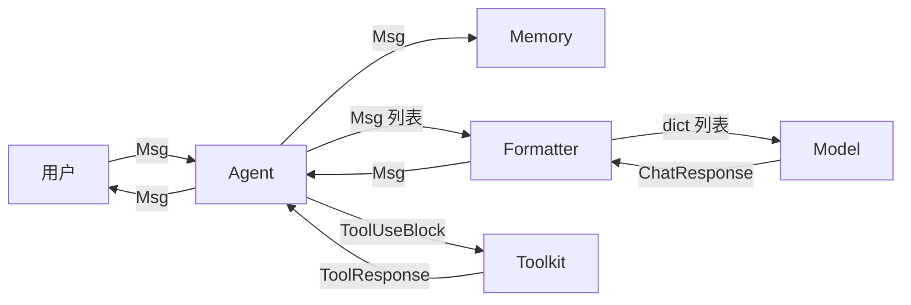

# 第 29 章：消息为什么是唯一接口

> **难度**：中等
>
> AgentScope 中，Agent、Model、Tool、Memory 全部通过 `Msg` 对象通信。为什么不让 Agent 直接返回字符串？为什么不定义多种消息类型？

## 决策回顾

打开 `src/agentscope/message/_message_base.py:21`：

```python
class Msg:
    def __init__(self, name, content, role, metadata=None, ...):
        self.name = name           # 发送者名称
        self.content = content     # str 或 ContentBlock 列表
        self.role = role           # user / assistant / system
        self.metadata = metadata   # 结构化输出等附加数据
        self.id = shortuuid.uuid()
        self.timestamp = ...
```

`Msg` 是系统中唯一的消息类型。所有模块通过它传递数据：



注意：`Msg` 在 Agent ↔ Memory、Agent ↔ Formatter 之间传递。Model 不直接接收 `Msg`，而是接收 Formatter 转换后的 `dict`。

---

## 被否方案一：多种消息类型

**方案**：为不同场景定义不同的消息类型：

```python
class UserMessage: ...
class AssistantMessage: ...
class ToolMessage: ...
class SystemMessage: ...
```

LangChain 就是这样做的——`HumanMessage`、`AIMessage`、`ToolMessage`、`SystemMessage` 各一个类。

**问题**：

1. **类型爆炸**：每种消息需要独立的序列化/反序列化逻辑
2. **接口割裂**：Memory 的 `add()` 方法需要处理 4 种类型：
   ```python
   async def add(self, msg: UserMessage | AssistantMessage | ToolMessage | SystemMessage):
       ...
   ```
3. **转换成本**：Agent 需要在 `Msg` → `ModelMessage` → `Msg` 之间来回转换

**AgentScope 的选择**：一个 `Msg` 类 + `role` 字段区分角色。`content` 字段统一承载所有内容类型（文本、工具调用、图片……）。

---

## 被否方案二：纯字符串

**方案**：Agent 直接返回字符串：

```python
async def reply(self, msg: str) -> str:
    ...
```

**问题**：

1. **无法携带工具调用**：模型返回的 `ToolUseBlock` 放不进字符串
2. **无法携带元数据**：token 用量、结构化输出等无处存放
3. **无法追踪来源**：不知道消息来自哪个 Agent

**AgentScope 的选择**：`content` 可以是字符串（简单场景）或 `ContentBlock` 列表（复杂场景）：

```python
# 简单场景
Msg("user", "你好", "user")

# 复杂场景：文本 + 工具调用
Msg("assistant", [
    TextBlock(type="text", text="我来查一下天气"),
    ToolUseBlock(type="tool_use", name="get_weather", input={"city": "北京"}),
], "assistant")
```

---

## 后果分析

### 好处

1. **统一接口**：所有模块只需理解一种类型
2. **序列化简单**：`to_dict()` / `from_dict()` 只需实现一次
3. **扩展容易**：添加新的 ContentBlock 类型不需要改 Msg 本身
4. **泛化能力**：`Msg` 可以承载文本、图片、音频、视频、工具调用

### 麻烦

1. **类型不够严格**：`content` 是 `str | list[ContentBlock]`，需要运行时检查
2. **角色语义模糊**：`role` 只有三个值，但实际消息的语义更丰富（工具结果是 "user" 角色，但这只是 OpenAI API 的约定）
3. **Metadata 滥用风险**：`metadata` 是自由字典，可能变成"什么都能往里塞"的垃圾桶

---

## 横向对比

| 框架 | 消息类型 | 优点 | 缺点 |
|------|---------|------|------|
| **AgentScope** | 1 个 `Msg` 类 | 接口简单 | 类型不够严格 |
| **LangChain** | 4+ 消息类 | 类型安全 | 类型爆炸，转换成本 |
| **AutoGen** | 字典 | 灵活 | 无类型检查 |
| **CrewAI** | 字符串 + 元组 | 极简 | 无法承载复杂内容 |

AgentScope 官方文档的 Basic Concepts > Message 页面详细展示了 `Msg` 的创建方法和 7 种 `ContentBlock` 类型（TextBlock、ThinkingBlock、ImageBlock、AudioBlock、VideoBlock、ToolUseBlock、ToolResultBlock），并说明了 `Msg` 在 Agent、用户和工具之间传递信息的核心作用。

AgentScope 1.0 论文对这一设计的说明是：

> "we abstract foundational components essential for agentic applications and provide unified interfaces and extensible modules"
>
> — AgentScope 1.0: A Comprehensive Framework for Building Agentic Applications, arXiv:2508.16279, Section 2

统一消息格式（unified message format）是框架的核心设计目标——所有组件通过同一种 `Msg` 类型通信，确保无缝互操作。

---

## 你的判断

开放性问题：

1. 如果要支持"消息路由"（根据消息类型分发到不同处理器），`Msg` 的单一类型是否够用？
2. `metadata` 字段是否应该用 Pydantic `BaseModel` 替代 `dict`，以获得类型检查？

---

## 下一章预告

`Msg` 是统一接口。但工具函数的注册方式——为什么是 `toolkit.register_tool_function(func)` 而不是在函数上加 `@tool` 装饰器？下一章我们看注册方式的选择。
