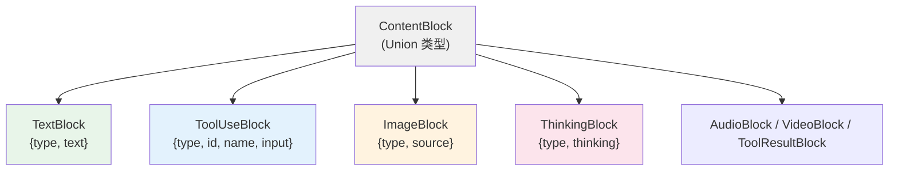

# 第 33 章：为什么 ContentBlock 是 TypedDict Union

> **难度**：进阶
>
> `TextBlock`、`ToolUseBlock`、`ImageBlock`……这些 ContentBlock 都是 `TypedDict`，没有共同基类，没有方法。为什么不用 OOP 继承？为什么不用 dataclass？

## 决策回顾

打开 `src/agentscope/message/_message_block.py`：

```python
# _message_block.py:9-94
class TextBlock(TypedDict, total=False):
    type: Literal["text"]
    text: str

class ThinkingBlock(TypedDict, total=False):
    type: Literal["thinking"]
    thinking: str

class ToolUseBlock(TypedDict, total=False):
    type: Literal["tool_use"]
    id: str
    name: str
    input: dict

class ImageBlock(TypedDict, total=False):
    type: Literal["image"]
    source: dict

# ... 还有 AudioBlock, VideoBlock, ToolResultBlock

ContentBlock = TextBlock | ThinkingBlock | ToolUseBlock | ImageBlock | ...
```

7 种 Block，全部是 `TypedDict`。它们唯一的共同点是 `type` 字段。

---

## 被否方案一：OOP 继承

**方案**：用抽象基类 + 子类：

```python
from abc import ABC, abstractmethod

class ContentBlockBase(ABC):
    @abstractmethod
    def to_dict(self) -> dict: ...

    @abstractmethod
    def get_type(self) -> str: ...

class TextBlock(ContentBlockBase):
    def __init__(self, text: str):
        self.text = text

    def to_dict(self) -> dict:
        return {"type": "text", "text": self.text}

    def get_type(self) -> str:
        return "text"
```

**问题**：

1. **创建开销大**：每个 Block 都需要 `TextBlock(text="hello")` 实例化
2. **序列化多余**：已经有 `dict` 了，为什么要先创建对象再 `.to_dict()`？
3. **与 API 不兼容**：OpenAI / Anthropic 的 API 直接返回 JSON dict，不需要再包装成对象

关键洞察：ContentBlock 的本质是**数据**，不是**行为**。它们不需要方法，只需要字段。

---

## 被否方案二：dataclass

**方案**：用 Python 标准库的 `dataclass`：

```python
from dataclasses import dataclass

@dataclass
class TextBlock:
    type: str = "text"
    text: str = ""
```

**问题**：

1. **不是 dict**：OpenAI API 返回的是 `{"type": "text", "text": "hello"}`，不是 `TextBlock` 对象
2. **需要转换**：`json.loads()` 返回 dict → 需要手动创建 dataclass → 传给 Formatter 时又需要 `.to_dict()`
3. **JSON 序列化需要额外工作**：`json.dumps(dataclass_obj)` 不直接工作

---

## AgentScope 的选择：TypedDict

`TypedDict` 的核心优势：**它既是 dict 又有类型提示**。

```python
# 创建——和普通 dict 一样
block = TextBlock(type="text", text="你好")  # 实际上就是 dict

# 类型检查——mypy/pyright 可以检查字段
def process(block: TextBlock):
    print(block["text"])  # 类型安全
    print(block["foo"])   # mypy 报错：未知字段

# 序列化——不需要 .to_dict()，它就是 dict
import json
json.dumps(block)  # 直接序列化

# 与 API 响应兼容——API 返回的 dict 直接就是 TextBlock
response = {"type": "text", "text": "你好"}
# 不需要转换！
```

### Union 类型的匹配

不同 Block 通过 `type` 字段区分，配合 Union 类型使用：

```python
def handle_block(block: ContentBlock):
    match block.get("type"):
        case "text":
            print(block["text"])         # 类型检查器知道这是 TextBlock
        case "tool_use":
            print(block["name"])         # 类型检查器知道这是 ToolUseBlock
```



---

## 后果分析

### 好处

1. **零序列化成本**：TypedDict 就是 dict，不需要 `.to_dict()` / `.from_dict()`
2. **API 兼容**：直接使用 OpenAI/Anthropic 返回的 JSON dict
3. **类型安全**：mypy 可以检查字段名和类型
4. **轻量**：没有对象创建开销

### 麻烦

1. **无共享基类**：不能 `isinstance(block, ContentBlockBase)`，只能检查 `block.get("type")`
2. **无行为**：不能给 Block 添加方法（如 `block.is_text()`）
3. **`total=False`**：所有字段都是可选的，类型检查不够严格
4. **IDE 补全较差**：TypedDict 的字段补全不如 dataclass 友好

---

## 横向对比

| 框架 | 消息块类型 | 优点 | 缺点 |
|------|-----------|------|------|
| **AgentScope** | TypedDict Union | 零序列化成本 | 无共享行为 |
| **LangChain** | dataclass / Pydantic | 有方法、有验证 | 需要转换 |
| **AutoGen** | dict | 极简 | 无类型安全 |
| **OpenAI SDK** | dataclass-like | API 原生 | 框架锁定 |

> **官方文档对照**：本文对应 [Basic Concepts > Message](https://docs.agentscope.io/basic-concepts)。官方文档展示了 ContentBlock 的 7 种类型，本章分析了为什么选择 TypedDict 而不是 dataclass 或 OOP 继承。
>
> **推荐阅读**：Python [PEP 589](https://peps.python.org/pep-0589/) 是 TypedDict 的官方规范。

---

## 你的判断

1. 如果要给 ContentBlock 添加验证逻辑（如 "ToolUseBlock 必须有 id"），TypedDict 还合适吗？
2. Pydantic 的 `BaseModel` 能否兼顾 TypedDict 的零序列化优势和 dataclass 的行为能力？

---

## 下一章预告

ContentBlock 的选择是"数据优先 vs 行为优先"。接下来我们看另一个数据相关的选择——配置为什么用 `ContextVar` 而不是全局变量或线程局部存储？
