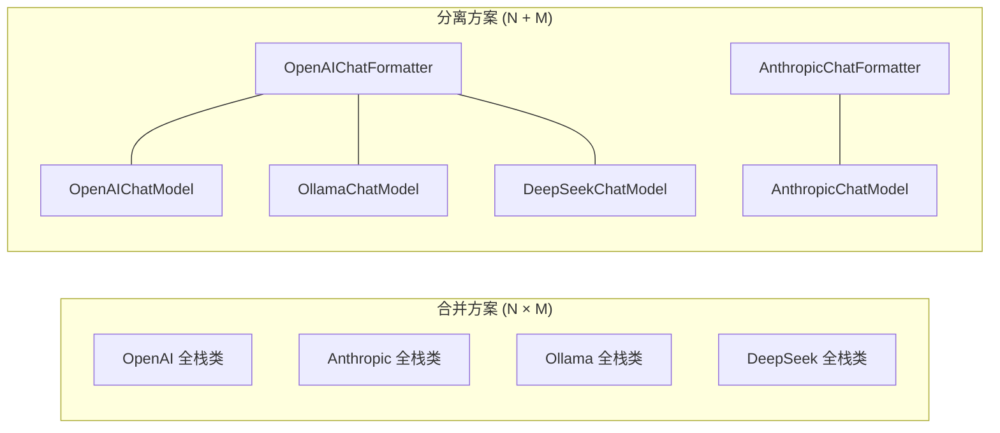

# 第 35 章：为什么 Formatter 独立于 Model

> **难度**：中等
>
> 其他框架把消息格式转换和 API 调用放在同一个类里。AgentScope 把它们分成 `Formatter` 和 `Model` 两个独立的类。为什么？

## 决策回顾

```
Agent 调用流程：

Msg 列表 → Formatter.format() → dict 列表 → Model.__call__() → ChatResponse → Formatter → Msg
```

`Formatter` 负责 `Msg ↔ dict` 转换，`Model` 负责 HTTP 调用。它们是独立的对象，通过 Agent 的 `reply` 方法协调。

---

## 被否方案：合并为 Model

**方案**：格式转换逻辑内置在 Model 中：

```python
class OpenAIModel:
    def __init__(self, model_name, api_key):
        self.client = openai.OpenAI(api_key=api_key)

    async def __call__(self, msgs: list[Msg], tools=None):
        # 格式转换 + API 调用都在这里
        messages = self._convert_msgs(msgs)
        response = await self.client.chat.completions.create(
            model=self.model_name,
            messages=messages,
            tools=tools,
        )
        return self._convert_response(response)

    def _convert_msgs(self, msgs):
        # OpenAI 格式转换
        result = []
        for msg in msgs:
            if msg.role == "system":
                result.append({"role": "system", "content": msg.content})
            ...
        return result
```

LangChain 和很多框架就是这样做的——`ChatOpenAI` 类同时处理格式和调用。

---

## 为什么分离

### 理由一：Ollama 兼容 OpenAI 格式

Ollama 的 API 兼容 OpenAI 格式，但 HTTP 调用方式不同：

```python
# 不分离时
class OllamaOpenAIModel:     # 格式 = OpenAI, 调用 = Ollama
class OllamaModel:            # 格式 = 自定义, 调用 = Ollama
class DeepSeekModel:          # 格式 = OpenAI, 调用 = DeepSeek

# 分离后
OpenAIChatFormatter + OllamaChatModel   # Ollama 用 OpenAI 格式
OllamaChatFormatter + OllamaChatModel   # Ollama 用自定义格式
OpenAIChatFormatter + DeepSeekChatModel # DeepSeek 用 OpenAI 格式
```

分离前需要 N × M 个类（N 种格式 × M 种 API）。分离后只需 N + M 个类。

### 理由二：独立测试

```python
# 测试格式转换——不需要 mock HTTP
formatter = OpenAIChatFormatter()
formatted = await formatter.format(msgs)
assert formatted[0]["role"] == "system"

# 测试 API 调用——不需要构造 Msg
model = OpenAIChatModel(...)
response = await model(formatted_dicts, tools=schemas)
```

### 理由三：独立替换

```python
# 运行时切换格式——不影响 Model
agent.formatter = AnthropicChatFormatter()  # 从 OpenAI 切换到 Anthropic 格式
# Model 不变，还是同一个 HTTP 客户端
```



---

## 后果分析

### 好处

1. **组合自由**：N + M 个类替代 N × M 个
2. **独立测试**：格式转换和 API 调用分别测试
3. **运行时替换**：可以动态切换格式化策略
4. **关注点分离**：Formatter 只关心格式，Model 只关心 HTTP

### 麻烦

1. **两处修改**：添加新模型 API 可能需要同时写 Formatter 和 Model
2. **协调复杂**：Formatter 和 Model 的接口需要匹配（stream 参数、tool_schema 格式等）
3. **额外概念**：开发者需要理解"为什么要两个类"

---

## 横向对比

| 框架 | 格式与调用 | 组织方式 |
|------|-----------|---------|
| **AgentScope** | 分离（Formatter + Model） | 正交分解 |
| **LangChain** | 合并（`ChatOpenAI` 等） | 按提供者分 |
| **LiteLLM** | 合并（统一接口） | 一个类适配所有 |
| **AutoGen** | 合并 | 按模型分 |

LiteLLM 的方案也有趣——用一个类适配所有 API，内部做格式转换。但扩展性不如 AgentScope 的分离方案。

> **官方文档对照**：本文对应 [Building Blocks > Models](https://docs.agentscope.io/building-blocks/models)。官方文档展示了不同模型的使用方法，本章解释了为什么 Formatter 和 Model 是分开的。
>
> **推荐阅读**：[AgentScope 1.0 论文](https://arxiv.org/pdf/2508.16279) 第 2.1 节讨论了 Formatter 与 Model 分离的设计理由。

---

## 你的判断

1. LiteLLM 的"统一接口"方案是否比 AgentScope 的"分离方案"更简单？在什么场景下？
2. 如果未来的模型 API 全部兼容 OpenAI 格式，Formatter 还有存在的必要吗？

---

## 下一章预告

我们看了 7 个具体的设计决策。最后一章，我们拉远视角，看整个架构的全景图和边界。
