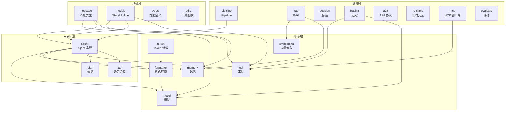
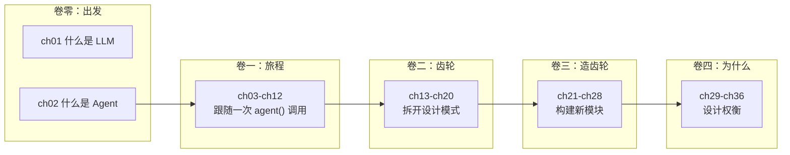

# 第 36 章：架构全景与边界

> **难度**：中等
>
> 我们已经看了 7 个具体的设计决策。这一章拉远视角，看整个框架的依赖图、模块边界、以及那些"存在但没展开"的角落。

## 依赖全景图

AgentScope 的 24 个顶层模块，按依赖关系分为四层：

### 依赖规则

1. **基础层不依赖任何其他层**——`message`、`module`、`types`、`_utils` 是独立的
2. **核心层只依赖基础层**——`memory` 依赖 `module` 和 `message`
3. **Agent 层依赖核心层**——`agent` 依赖 `memory`、`model`、`formatter`、`tool`
4. **编排层依赖 Agent 层**——`pipeline` 依赖 `agent`

这个分层是自然形成的，不是人为规定的——如果你违反了层级（比如让 `message` 依赖 `agent`），会出现循环导入。

---

## 核心模块 vs 边缘模块

### 核心模块（卷一至卷三覆盖的）

| 模块 | 行数 | 职责 | 成熟度 |
|------|------|------|--------|
| `message` | ~200 | 消息类型 | 稳定 |
| `module` | ~120 | StateModule | 稳定 |
| `memory` | ~1200 | 记忆系统 | 稳定 |
| `model` | ~1500 | 模型适配 | 稳定 |
| `formatter` | ~2000 | 格式转换 | 稳定 |
| `tool` | ~1700 | 工具系统 | 稳定 |
| `agent` | ~2000 | Agent 实现 | 稳定 |
| `pipeline` | ~300 | Pipeline 编排 | 稳定 |

### 边缘模块（本书未深入展开的）

| 模块 | 行数 | 职责 | 备注 |
|------|------|------|------|
| `rag` | ~800 | RAG 检索 | 依赖 embedding + vector store |
| `embedding` | ~300 | 向量嵌入 | 为 RAG 服务 |
| `token` | ~200 | Token 计数 | 为 Formatter 的截断服务 |
| `tracing` | ~600 | OpenTelemetry | 生产环境可观测性 |
| `session` | ~400 | 会话管理 | 跨请求状态持久化 |
| `plan` | ~300 | 规划子系统 | ReActAgent 的规划功能 |
| `tts` | ~200 | 语音合成 | RealtimeAgent 的语音输出 |

### 协议/集成模块

| 模块 | 职责 | 备注 |
|------|------|------|
| `a2a` | Agent-to-Agent 协议 | Google A2A 标准 |
| `mcp` | Model Context Protocol | 接入外部 MCP Server |
| `realtime` | 实时语音交互 | WebSocket + 流式音频 |
| `evaluate` | 评估和基准测试 | Benchmark 工具 |

### 空壳/开发中模块

| 模块 | 状态 |
|------|------|
| `tune` | 模型微调——占位，功能未完整 |
| `tuner` | 微调工具——与 `tune` 重叠？ |

---

## 边界模糊处

### _utils/_common.py：工具箱还是垃圾桶？

`_utils/_common.py` 包含了各种工具函数：

- `_parse_tool_function`：JSON Schema 生成（属于 `tool` 模块）
- `_get_timestamp`：时间戳（通用）
- `_remove_title_field`：Schema 处理（属于 `tool` 模块）

问题：`_parse_tool_function` 是工具系统的一部分，但它放在 `_utils` 里。这是因为它是"解析工具函数"的通用逻辑，被 `_toolkit.py` 和测试文件共同使用。

### hooks/ vs agent/_agent_meta.py

`hooks/` 目录有 Hook 类型定义，但 Hook 的核心逻辑在 `agent/_agent_meta.py`。为什么分开放？

- `hooks/` 定义了 Hook 的**类型**和**接口**
- `_agent_meta.py` 定义了 Hook 的**注入机制**

这是"接口"和"实现"的分离——合理但容易混淆。

### types/ 的角色

`types/` 目录定义了 `ToolFunction`、`JSONSerializableObject` 等跨模块使用的类型。它是最底层的依赖——几乎所有模块都导入它。但它不是 Python 标准的 `typing`——是 AgentScope 自定义的类型定义。

---

## 架构的演化方向

### 已有的扩展点

本书覆盖的扩展点：

- 自定义 Memory（继承 `MemoryBase`）
- 自定义 Formatter（继承 `FormatterBase`）
- 自定义 Agent（继承 `AgentBase`）
- 自定义工具（`register_tool_function`）
- 自定义中间件（`register_middleware`）
- 自定义 Hook（`register_*_hook`）

### 可能的演化方向

1. **更多 Memory 后端**：向量数据库 Memory、图数据库 Memory
2. **更多 Model 适配**：新模型 API（如 Grok、Mistral）
3. **A2A 生态**：跨框架 Agent 协作
4. **MCP 集成**：更多 MCP Server 接入
5. **多模态 Agent**：视觉、语音、视频输入

---

## 全书复盘

从"什么是 LLM"到"为什么这样设计"，你走过了 36 章的完整旅程。

你现在能够：
- **读**懂 AgentScope 的任意源码文件
- **追踪**一个请求从 `agent()` 到返回的完整路径
- **构建**新的工具、Memory、Formatter、Agent、Pipeline
- **理解**框架的设计决策及其权衡
- **参与**架构讨论和代码贡献

下一步？

1. 去 [GitHub Issues](https://github.com/modelscope/agentscope/issues) 找一个 "good first issue"
2. 尝试给框架添加一个新功能
3. 在讨论区分享你的理解

AgentScope 官方文档覆盖了本书讨论的所有模块：Basic Concepts 介绍 Msg、Agent、Model 等核心概念，Building Blocks 展示各模块的用法和配置方法。本书从源码角度补充了这些设计决策背后的理由。

AgentScope 1.0 论文（arXiv:2508.16279）提供了框架的完整技术报告，涵盖 Foundational Components（Section 2.1）、Agent Infrastructure（Section 2.2）和 Multi-Agent Orchestration（Section 2.3）三大设计维度。

AgentScope 源码带读系列视频教程覆盖了以下核心内容：
- `StateModule` 的序列化机制和子模块自动追踪
- Memory 模块的工作记忆和长期记忆实现
- ReAct Agent 的推理循环和工具调用流程
- Toolkit 的注册、中间件和分组机制

---

## 你的判断

贯穿全卷的开放性问题：

1. 如果让你从零重写 AgentScope，你会保留哪些设计？改变哪些？
2. 在"简单性"和"灵活性"之间，AgentScope 的平衡点在哪里？
3. 哪个设计决策最让你惊讶？为什么？
