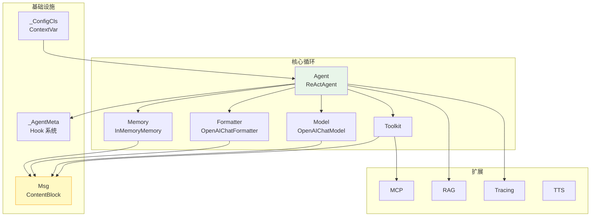

# 第 36 章 全景回顾

> 最后一章：站在最高处，回顾整个架构的设计哲学和边界。

> **源码验证日期**: 2026-05-11, commit `f17cfd0a`

---

## 36.1 架构全景

---

## 36.2 设计哲学

### 1. 数据优先

`Msg` + `TypedDict` 的组合表明：AgentScope 把数据放在中心位置。模块之间通过数据（`Msg`）通信，而不是通过行为（接口调用）。

### 2. 组合优于继承

Agent 不是通过复杂的继承树构建的，而是通过组合：`Agent(Model, Formatter, Toolkit, Memory)`。每个组件可以独立替换。

### 3. 约定优于配置

文件命名（`_` 前缀）、文档字符串格式、类型注解——这些约定减少了配置的需要。只要遵循约定，框架自动处理。

### 4. 实用性优先

上帝类（`Toolkit`）、元类 Hook、TypedDict 而非 dataclass——这些选择都是为了使用便利，而非理论纯粹。

---

## 36.3 边界模糊处

### `_utils/_common.py`

这是一个"什么都往里塞"的文件。`_save_base64_data`、`_execute_async_or_sync_func` 等工具函数都在这里。它是代码的灰色地带——既不属于任何模块，又被多个模块依赖。

### `evaluate/` 和 `tuner/`

这些模块的定位在框架中有些模糊——它们是核心功能还是附加功能？AgentScope 把它们放在子包里，但使用频率远低于核心五件套（Agent/Model/Formatter/Toolkit/Memory）。

---

## 36.4 你现在是什么水平？

| 卷 | 读者能力 | 你 |
|----|---------|-----|
| 卷零 | 理解 LLM 和 Agent | ✓ |
| 卷一 | 能追踪请求流程 | ✓ |
| 卷二 | 能理解设计模式 | ✓ |
| 卷三 | 能独立添加新功能 | ✓ |
| 卷四 | 能参与架构讨论 | ✓ |

你已经读完了整本书。从"什么是 LLM"到"为什么要用 ContextVar"，你走完了从零基础到架构贡献者的完整旅程。

---

## 36.5 下一步

1. **提交你的第一个 PR**：用第 28 章的方法
2. **阅读其他 Agent 框架的源码**：用同样的方法追踪调用链
3. **参与社区讨论**：GitHub Issues、Discord、PR Review
4. **写你自己的框架**：把你学到的设计模式用上

祝你在 Agent 开发的旅程上一路顺风！
